# 前端应用架构

<cite>
**本文档引用的文件**
- [frontend/src/main.ts](file://frontend/src/main.ts)
- [frontend/src/App.vue](file://frontend/src/App.vue)
- [frontend/vite.config.ts](file://frontend/vite.config.ts)
- [frontend/package.json](file://frontend/package.json)
- [frontend/src/router/index.ts](file://frontend/src/router/index.ts)
- [frontend/src/stores/user.ts](file://frontend/src/stores/user.ts)
- [frontend/src/utils/request.ts](file://frontend/src/utils/request.ts)
- [frontend/src/composables/useWebSocket.ts](file://frontend/src/composables/useWebSocket.ts)
- [frontend/src/components/layout/AppLayout.vue](file://frontend/src/components/layout/AppLayout.vue)
- [frontend/src/styles/variables.css](file://frontend/src/styles/variables.css)
- [frontend/src/api/auth.ts](file://frontend/src/api/auth.ts)
- [frontend/src/views/Dashboard.vue](file://frontend/src/views/Dashboard.vue)
- [frontend/src/types/models.d.ts](file://frontend/src/types/models.d.ts)
- [frontend/src/composables/useKeyboardShortcuts.ts](file://frontend/src/composables/useKeyboardShortcuts.ts)
- [frontend/postcss.config.js](file://frontend/postcss.config.js)
</cite>

## 目录
1. [简介](#简介)
2. [项目结构](#项目结构)
3. [核心组件](#核心组件)
4. [架构总览](#架构总览)
5. [详细组件分析](#详细组件分析)
6. [依赖关系分析](#依赖关系分析)
7. [性能考量](#性能考量)
8. [故障排查指南](#故障排查指南)
9. [结论](#结论)
10. [附录](#附录)

## 简介
本文件智能审查系统的前端应用采用 Vue 3 + TypeScript 技术栈，结合 Vite 构建工具与 Element Plus UI 组件库，实现现代化、可维护的单页应用（SPA）。应用围绕“布局-业务-通用”三层组件体系组织，通过 Pinia 实现状态管理，Vue Router 提供路由与导航守卫，Axios 封装统一 HTTP 客户端，并内置 WebSocket 管理器实现任务进度与通知的实时推送。

## 项目结构
前端代码位于 frontend 目录，采用按功能域划分的目录组织方式：
- 应用入口与全局配置：main.ts、App.vue、vite.config.ts、package.json
- 路由与导航：router/index.ts
- 状态管理：stores/user.ts
- API 与 HTTP 客户端：api/*、utils/request.ts
- 组件层：components/layout、components/common、components/*
- 视图层：views/*
- 工具与可组合函数：composables/*
- 样式与主题：styles/*
- 类型定义：types/*
- 构建与样式工具：postcss.config.js

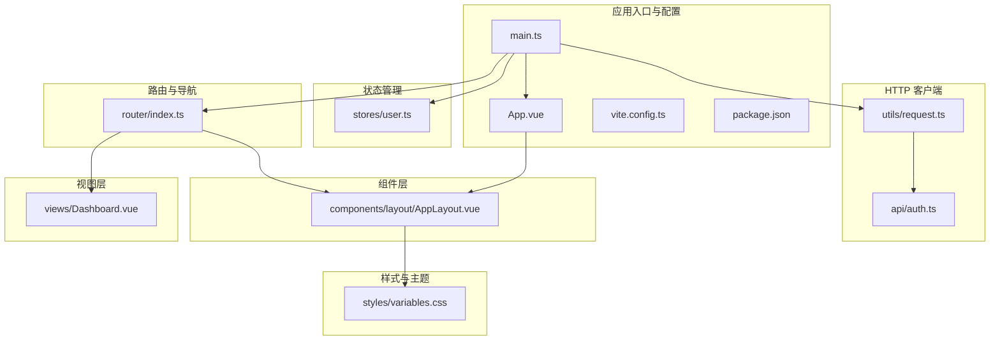

**图表来源**
- [frontend/src/main.ts:1-30](file://frontend/src/main.ts#L1-L30)
- [frontend/src/App.vue:1-202](file://frontend/src/App.vue#L1-L202)
- [frontend/vite.config.ts:1-78](file://frontend/vite.config.ts#L1-L78)
- [frontend/package.json:1-46](file://frontend/package.json#L1-L46)
- [frontend/src/router/index.ts:1-116](file://frontend/src/router/index.ts#L1-L116)
- [frontend/src/stores/user.ts:1-49](file://frontend/src/stores/user.ts#L1-L49)
- [frontend/src/utils/request.ts:1-98](file://frontend/src/utils/request.ts#L1-L98)
- [frontend/src/api/auth.ts:1-28](file://frontend/src/api/auth.ts#L1-L28)
- [frontend/src/components/layout/AppLayout.vue:1-747](file://frontend/src/components/layout/AppLayout.vue#L1-L747)
- [frontend/src/views/Dashboard.vue:1-200](file://frontend/src/views/Dashboard.vue#L1-L200)
- [frontend/src/styles/variables.css:1-212](file://frontend/src/styles/variables.css#L1-L212)

**章节来源**
- [frontend/src/main.ts:1-30](file://frontend/src/main.ts#L1-L30)
- [frontend/src/App.vue:1-202](file://frontend/src/App.vue#L1-L202)
- [frontend/vite.config.ts:1-78](file://frontend/vite.config.ts#L1-L78)
- [frontend/package.json:1-46](file://frontend/package.json#L1-L46)

## 核心组件
- 应用入口与全局配置：创建 Vue 应用实例，注册 Pinia、Router；全局 WebSocket 初始化；挂载应用。
- 布局组件：AppLayout 提供侧边菜单、头部工具栏、面包屑、用户下拉菜单、全局搜索与快捷键等。
- 业务组件：Dashboard、TaskHistory、TaskDetails、StandardLibrary、SystemManagement 等视图组件。
- 通用组件：EmptyState、DocumentPreview、DwgPreview、GlobalSearch、KnowledgeTreeSelector、NotificationCenter、ModeCapabilitiesPanel 等。
- 状态管理：Pinia Store（user.ts）集中管理用户令牌、用户信息与角色判断。
- 路由与导航：基于 Vue Router 的 History 模式，支持导航守卫与页面权限控制。
- UI 组件库：Element Plus，支持按需自动导入与主题变量覆盖。
- API 集成：Axios 封装统一请求/响应拦截器、请求取消、错误处理与权限校验。
- WebSocket：统一管理连接、订阅、断线重连与消息分发。
- 样式与主题：CSS 变量驱动的设计系统，覆盖 Element Plus 主题变量。

**章节来源**
- [frontend/src/main.ts:1-30](file://frontend/src/main.ts#L1-L30)
- [frontend/src/components/layout/AppLayout.vue:1-747](file://frontend/src/components/layout/AppLayout.vue#L1-L747)
- [frontend/src/stores/user.ts:1-49](file://frontend/src/stores/user.ts#L1-L49)
- [frontend/src/router/index.ts:1-116](file://frontend/src/router/index.ts#L1-L116)
- [frontend/src/utils/request.ts:1-98](file://frontend/src/utils/request.ts#L1-L98)
- [frontend/src/composables/useWebSocket.ts:1-179](file://frontend/src/composables/useWebSocket.ts#L1-L179)
- [frontend/src/styles/variables.css:1-212](file://frontend/src/styles/variables.css#L1-L212)

## 架构总览
应用采用“入口配置 -> 插件注册 -> 全局初始化 -> 路由守卫 -> 组件渲染”的控制流。Pinia 负责状态持久化与跨组件共享；Element Plus 提供统一 UI；Axios 统一封装 HTTP；WebSocket 管理器负责实时通信；Vite 提供开发与生产构建能力。

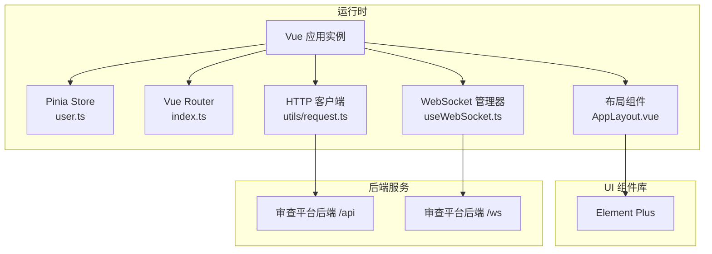

**图表来源**
- [frontend/src/main.ts:1-30](file://frontend/src/main.ts#L1-L30)
- [frontend/src/router/index.ts:1-116](file://frontend/src/router/index.ts#L1-L116)
- [frontend/src/stores/user.ts:1-49](file://frontend/src/stores/user.ts#L1-L49)
- [frontend/src/utils/request.ts:1-98](file://frontend/src/utils/request.ts#L1-L98)
- [frontend/src/composables/useWebSocket.ts:1-179](file://frontend/src/composables/useWebSocket.ts#L1-L179)
- [frontend/src/components/layout/AppLayout.vue:1-747](file://frontend/src/components/layout/AppLayout.vue#L1-L747)

## 详细组件分析

### 应用入口与全局配置
- 创建应用实例并注册插件：Pinia（带持久化）、Router。
- 在路由 afterEach 中根据登录状态自动连接 WebSocket。
- 在 App.vue 中通过 Element Plus ConfigProvider 设置语言、消息组件行为与全局样式。

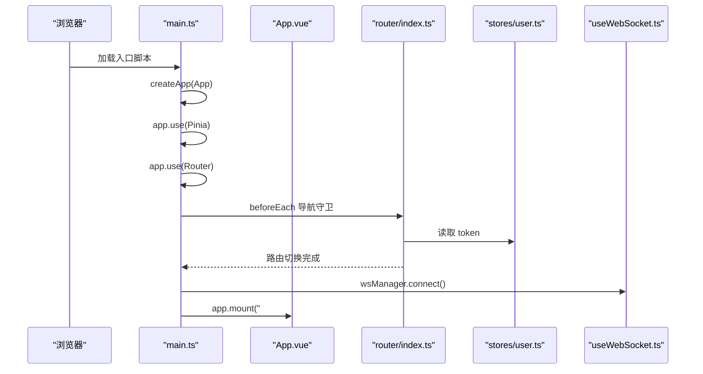

**图表来源**
- [frontend/src/main.ts:1-30](file://frontend/src/main.ts#L1-L30)
- [frontend/src/router/index.ts:96-113](file://frontend/src/router/index.ts#L96-L113)
- [frontend/src/stores/user.ts:1-49](file://frontend/src/stores/user.ts#L1-L49)
- [frontend/src/composables/useWebSocket.ts:45-97](file://frontend/src/composables/useWebSocket.ts#L45-L97)
- [frontend/src/App.vue:6-14](file://frontend/src/App.vue#L6-L14)

**章节来源**
- [frontend/src/main.ts:1-30](file://frontend/src/main.ts#L1-L30)
- [frontend/src/App.vue:1-202](file://frontend/src/App.vue#L1-L202)

### 路由与导航设计
- 路由结构：登录页与嵌套布局（AppLayout）下的多个子路由。
- 导航守卫：统一取消未完成请求；鉴权（requiresAuth）与管理员权限（requiresAdmin）控制；登录页防未登录访问。
- 页面标题：通过 meta.title 控制面包屑与页面标题。

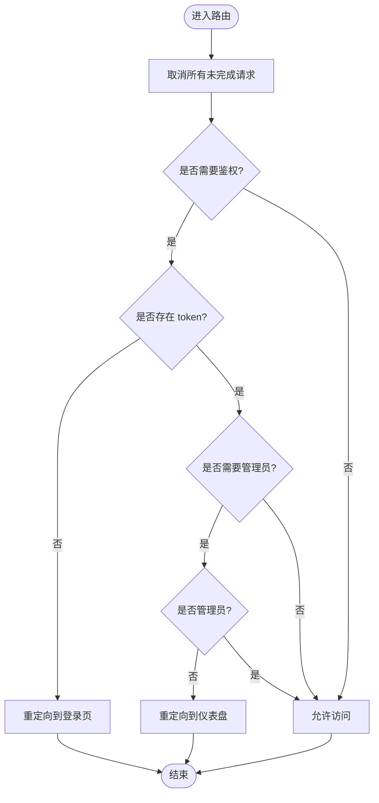

**图表来源**
- [frontend/src/router/index.ts:96-113](file://frontend/src/router/index.ts#L96-L113)
- [frontend/src/utils/request.ts:90-95](file://frontend/src/utils/request.ts#L90-L95)

**章节来源**
- [frontend/src/router/index.ts:1-116](file://frontend/src/router/index.ts#L1-L116)
- [frontend/src/utils/request.ts:1-98](file://frontend/src/utils/request.ts#L1-L98)

### 状态管理（Pinia）
- Store 模块：user.ts 定义 token、userInfo、登录/登出、角色判断（ADMIN/MANAGER/USER）。
- 持久化：通过 pinia-plugin-persistedstate 实现刷新后状态保留。
- 使用方式：在组件中通过 useUserStore 访问与更新状态。

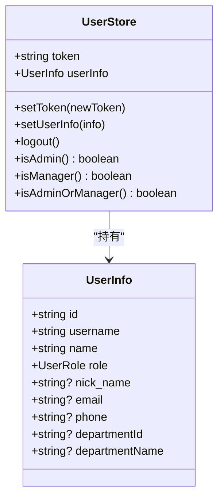

**图表来源**
- [frontend/src/stores/user.ts:1-49](file://frontend/src/stores/user.ts#L1-L49)
- [frontend/src/types/models.d.ts:8-19](file://frontend/src/types/models.d.ts#L8-L19)

**章节来源**
- [frontend/src/stores/user.ts:1-49](file://frontend/src/stores/user.ts#L1-L49)
- [frontend/src/types/models.d.ts:1-409](file://frontend/src/types/models.d.ts#L1-L409)

### UI 组件库与主题定制
- Element Plus：通过 unplugin-auto-import 与 unplugin-vue-components 实现按需导入与组件解析器。
- 主题覆盖：CSS 变量文件覆盖 Element Plus 的 --el-* 变量，统一品牌色与语义色。
- App.vue 中通过 ElConfigProvider 设置语言、消息组件最大数量、动画时长与偏移等。

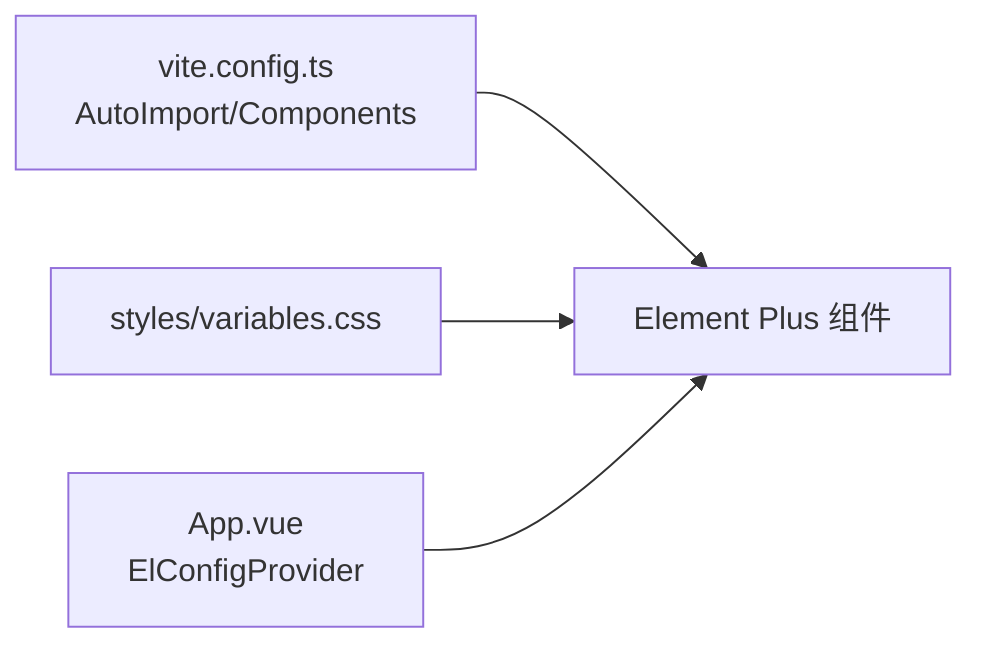

**图表来源**
- [frontend/vite.config.ts:21-28](file://frontend/vite.config.ts#L21-L28)
- [frontend/src/styles/variables.css:104-125](file://frontend/src/styles/variables.css#L104-L125)
- [frontend/src/App.vue:6-14](file://frontend/src/App.vue#L6-L14)

**章节来源**
- [frontend/vite.config.ts:1-78](file://frontend/vite.config.ts#L1-L78)
- [frontend/src/styles/variables.css:1-212](file://frontend/src/styles/variables.css#L1-L212)
- [frontend/src/App.vue:1-202](file://frontend/src/App.vue#L1-L202)

### API 集成模式
- HTTP 客户端：基于 Axios，统一 baseURL 为 /api，超时 30 秒。
- 请求拦截器：自动附加 Authorization 头；为每个请求创建 AbortController，支持路由切换时统一取消。
- 响应拦截器：统一处理 { code, message, data } 格式；401 清空本地状态并跳转登录；403/404/其他错误统一提示。
- 取消机制：cancelAllPendingRequests 在路由切换时调用，避免旧页面请求污染新页面。

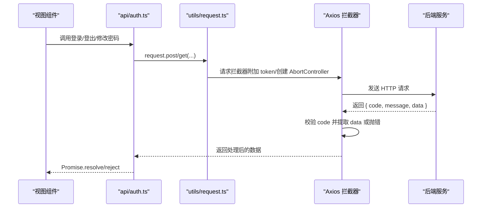

**图表来源**
- [frontend/src/api/auth.ts:1-28](file://frontend/src/api/auth.ts#L1-L28)
- [frontend/src/utils/request.ts:6-85](file://frontend/src/utils/request.ts#L6-L85)

**章节来源**
- [frontend/src/utils/request.ts:1-98](file://frontend/src/utils/request.ts#L1-L98)
- [frontend/src/api/auth.ts:1-28](file://frontend/src/api/auth.ts#L1-L28)

### WebSocket 实时通信
- 连接建立：根据协议与主机拼接 wsUrl，携带 token 查询参数；onopen 后重订阅任务。
- 消息分发：收到消息后解析为 WsMessage，分别派发给全局监听器与任务特定监听器。
- 断线重连：onclose 后延迟 3 秒重连；onerror 输出错误日志。
- 订阅管理：subscribe/ unsubscribe 管理任务订阅集合；resubscribeTasks 在重连后恢复订阅。

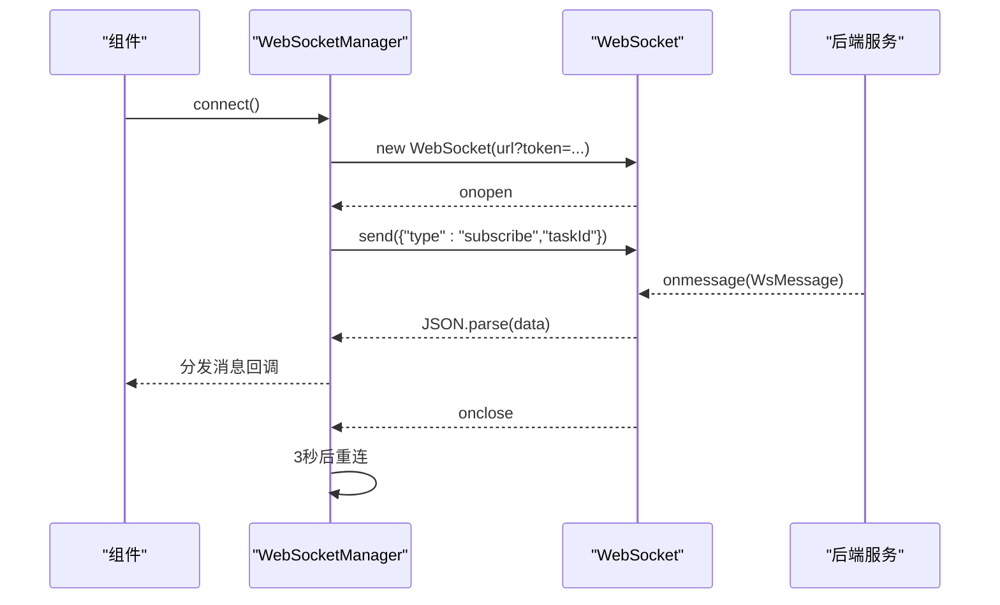

**图表来源**
- [frontend/src/composables/useWebSocket.ts:37-150](file://frontend/src/composables/useWebSocket.ts#L37-L150)

**章节来源**
- [frontend/src/composables/useWebSocket.ts:1-179](file://frontend/src/composables/useWebSocket.ts#L1-L179)
- [frontend/src/main.ts:21-27](file://frontend/src/main.ts#L21-L27)

### 布局组件设计
- 侧边栏：折叠/展开、菜单分组、图标与标题、移动端遮罩层。
- 头部：面包屑、安全提示、全局搜索、全屏、快捷键帮助、用户下拉菜单。
- 权限控制：菜单项根据 isAdmin/isAdminOrManager 动态显示。
- 过渡动画：页面切换使用 fade-slide 过渡。
- 响应式：小屏设备下侧边栏抽屉式交互。

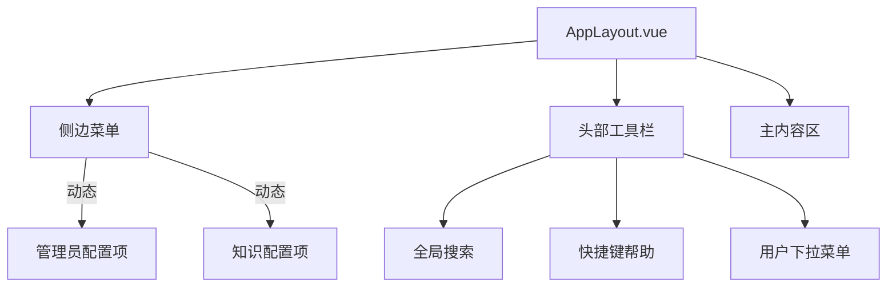

**图表来源**
- [frontend/src/components/layout/AppLayout.vue:1-747](file://frontend/src/components/layout/AppLayout.vue#L1-L747)

**章节来源**
- [frontend/src/components/layout/AppLayout.vue:1-747](file://frontend/src/components/layout/AppLayout.vue#L1-L747)

### 视图组件与业务场景
- Dashboard：支持用户/管理员双视图，包含 KPI 卡片、趋势图表、部门效率排行、最近任务与快捷操作等。
- TaskHistory/TaskDetails：任务历史与详情展示，支持文件树、文本预览、DWG 预览、问题卡片列表与误判处理。
- StandardLibrary：标准库管理，包含本地标准、MaxKB、术语表与误判库。
- SystemManagement：系统配置与管理页面。
- LLMConfig/PipelineConfig/ReviewRules/RegexTool：系统配置相关页面。

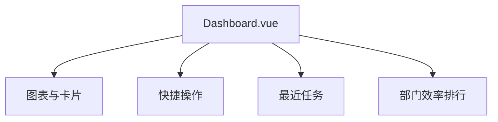

**图表来源**
- [frontend/src/views/Dashboard.vue:1-200](file://frontend/src/views/Dashboard.vue#L1-L200)

**章节来源**
- [frontend/src/views/Dashboard.vue:1-200](file://frontend/src/views/Dashboard.vue#L1-L200)

### 组件设计规范与样式管理
- 设计系统：通过 CSS 变量定义品牌色、语义色、间距、字号、圆角、阴影与 Element Plus 覆盖变量。
- 响应式策略：媒体查询适配移动端侧边栏抽屉、头部工具栏简化与内容区间距调整。
- 过渡与动画：页面切换过渡、菜单折叠过渡、按钮悬停态与高亮态。
- 可访问性：键盘快捷键支持（useKeyboardShortcuts），全局搜索与快捷键帮助对话框。

**章节来源**
- [frontend/src/styles/variables.css:1-212](file://frontend/src/styles/variables.css#L1-L212)
- [frontend/src/components/layout/AppLayout.vue:363-382](file://frontend/src/components/layout/AppLayout.vue#L363-L382)
- [frontend/src/composables/useKeyboardShortcuts.ts:1-51](file://frontend/src/composables/useKeyboardShortcuts.ts#L1-L51)

## 依赖关系分析
- 构建与开发：Vite 提供开发服务器与代理（/api -> 后端、/ws -> WebSocket），rollupOptions 手动分包优化。
- 依赖管理：Vue 3、Vue Router、Pinia、Element Plus、Axios、ECharts、@mlightcad/libredwg-web 等。
- PostCSS：autoprefixer 自动添加浏览器前缀。

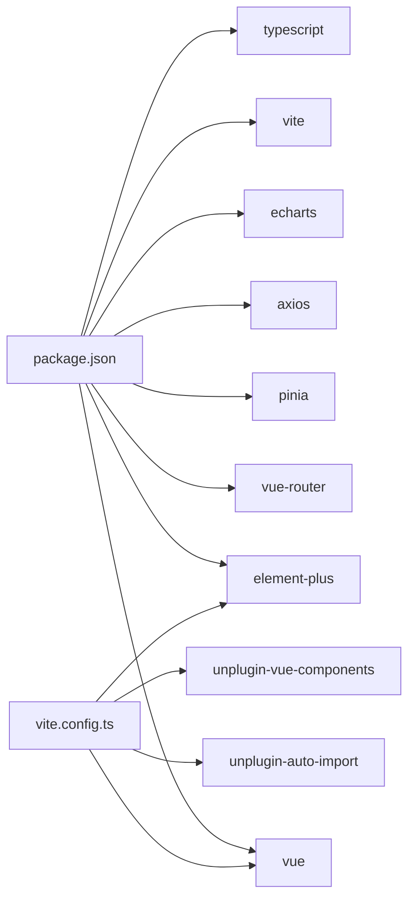

**图表来源**
- [frontend/package.json:12-28](file://frontend/package.json#L12-L28)
- [frontend/vite.config.ts:13-29](file://frontend/vite.config.ts#L13-L29)

**章节来源**
- [frontend/package.json:1-46](file://frontend/package.json#L1-L46)
- [frontend/vite.config.ts:1-78](file://frontend/vite.config.ts#L1-L78)
- [frontend/postcss.config.js:1-6](file://frontend/postcss.config.js#L1-L6)

## 性能考量
- 构建目标：es2020，面向可控内网浏览器（Chrome 90+），避免降级带来的体积与兼容性问题。
- 手动分包：将 vue-vendor、element-plus、echarts 独立拆分，提升缓存命中与并行加载效率。
- 依赖预构建：optimizeDeps.exclude 排除大型 WASM 依赖，assetsInclude 包含 .wasm 资源。
- 开发体验：esbuild 跳过类型检查，加速构建；代理配置简化联调。
- 请求取消：AbortController 在路由切换时统一取消未完成请求，减少资源浪费。

**章节来源**
- [frontend/vite.config.ts:35-56](file://frontend/vite.config.ts#L35-L56)
- [frontend/vite.config.ts:73-77](file://frontend/vite.config.ts#L73-L77)
- [frontend/src/utils/request.ts:11-38](file://frontend/src/utils/request.ts#L11-L38)

## 故障排查指南
- 登录过期：401 响应触发用户登出并跳转登录页，同时提示“登录已过期，请重新登录”。
- 权限不足：403 提示“没有操作权限”，非管理员访问管理员页面将被重定向至仪表盘。
- 资源不存在：404 提示“请求的资源不存在”。
- 网络异常：超时或连接失败统一提示“网络连接失败，请检查网络”或“请求超时，请检查网络”。

**章节来源**
- [frontend/src/utils/request.ts:57-84](file://frontend/src/utils/request.ts#L57-L84)

## 结论
该前端应用以 Vue 3 为核心，结合 Pinia、Element Plus、Axios 与 WebSocket，构建了清晰的三层组件体系与完善的权限与通信机制。通过 Vite 的工程化配置与 CSS 变量主题系统，实现了良好的可维护性与可扩展性。建议后续持续完善组件文档与自动化测试，进一步提升开发效率与质量保障。

## 附录
- 类型定义：models.d.ts 提供完整的业务模型与枚举类型，支撑各视图与 API 的类型安全。
- 快捷键：useKeyboardShortcuts 提供全局快捷键注册与处理，提升用户体验。

**章节来源**
- [frontend/src/types/models.d.ts:1-409](file://frontend/src/types/models.d.ts#L1-L409)
- [frontend/src/composables/useKeyboardShortcuts.ts:1-51](file://frontend/src/composables/useKeyboardShortcuts.ts#L1-L51)