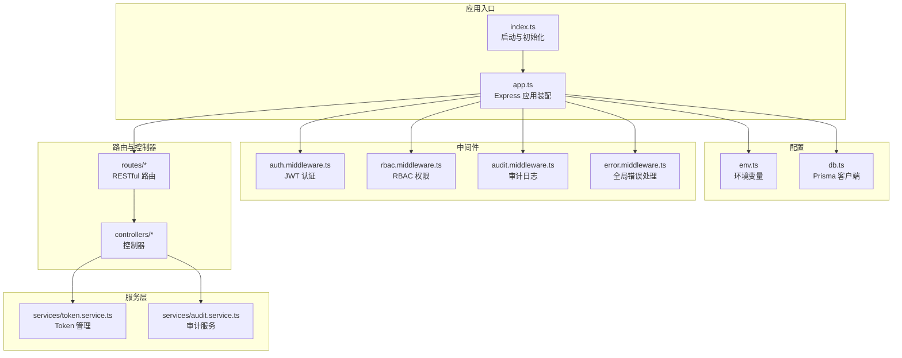
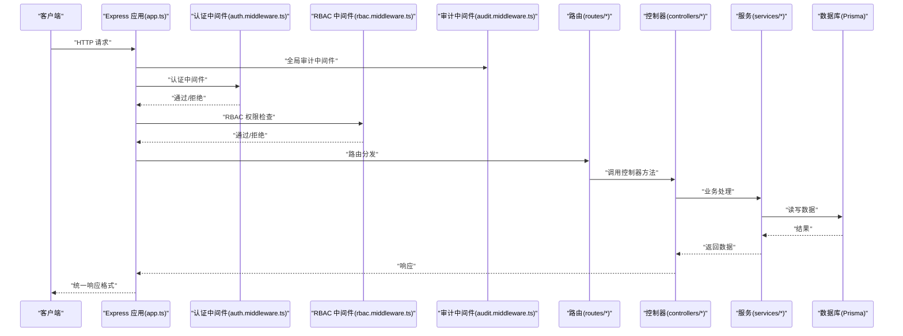
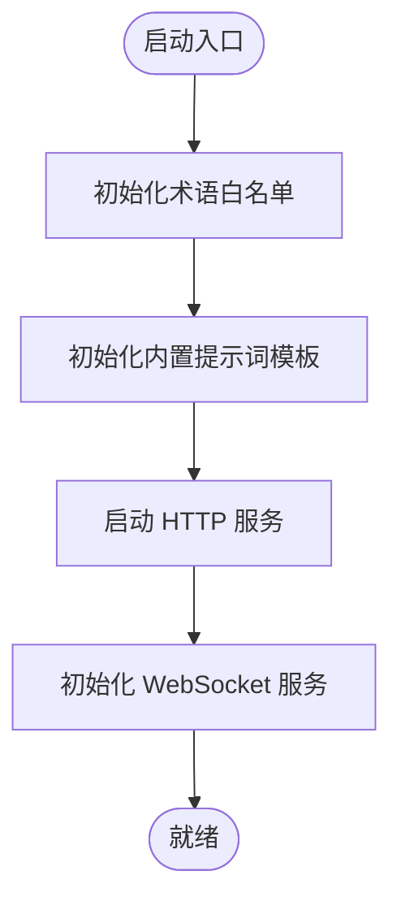
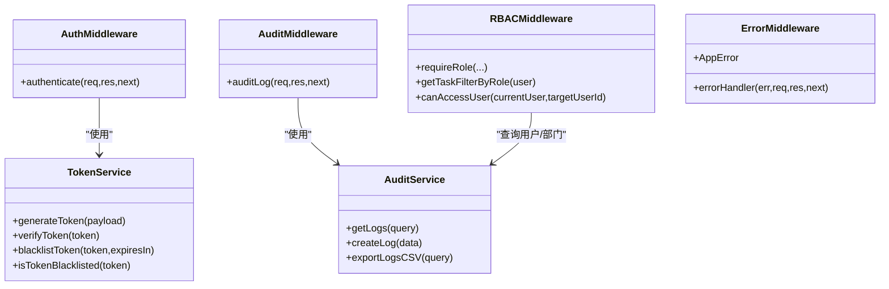
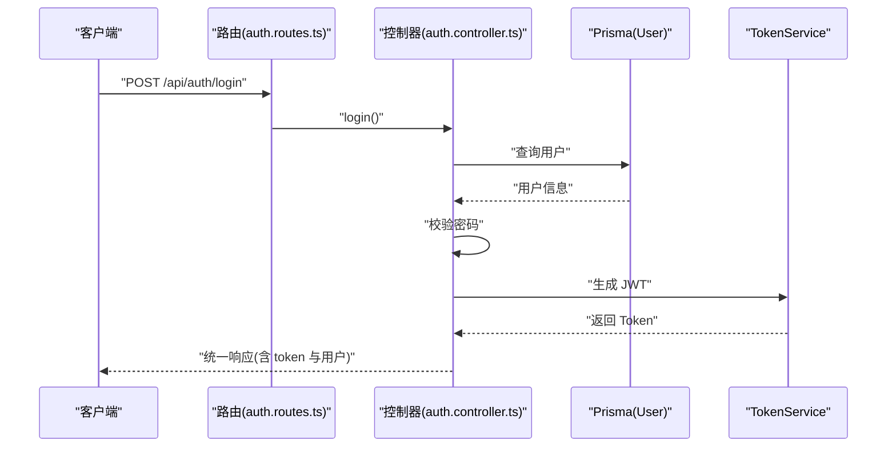
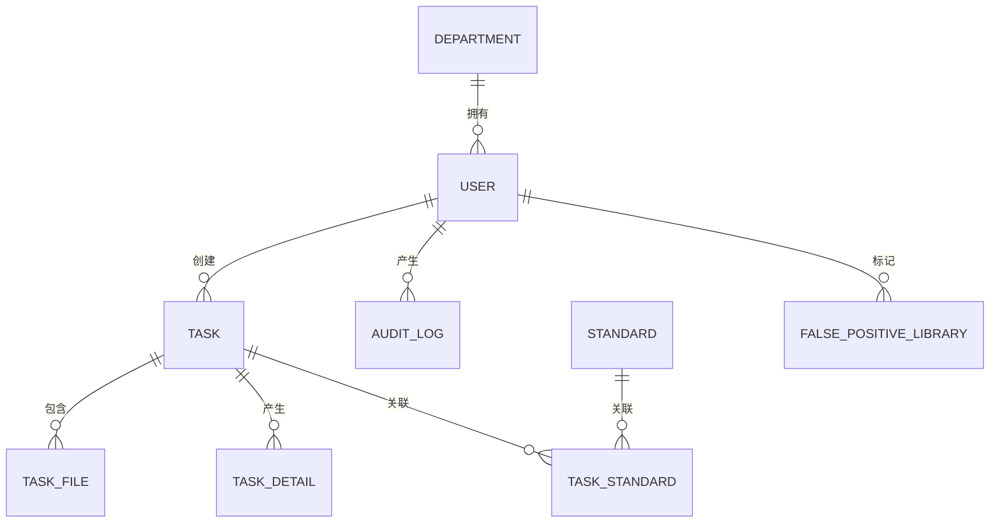
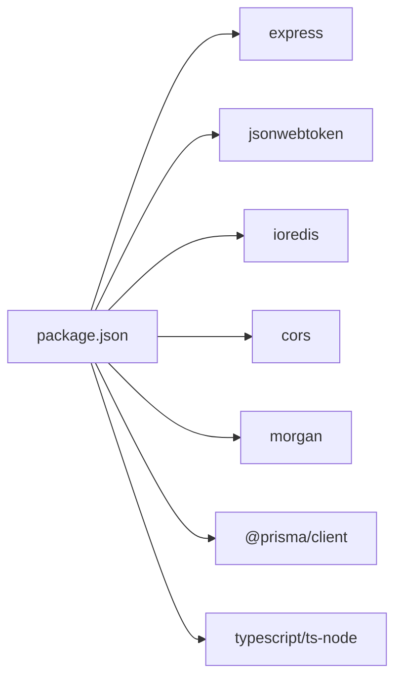

# 后端服务架构

<cite>
**本文引用的文件**
- [backend/src/index.ts](file://backend/src/index.ts)
- [backend/src/app.ts](file://backend/src/app.ts)
- [backend/package.json](file://backend/package.json)
- [backend/src/config/env.ts](file://backend/src/config/env.ts)
- [backend/src/config/db.ts](file://backend/src/config/db.ts)
- [backend/prisma/schema.prisma](file://backend/prisma/schema.prisma)
- [backend/src/middlewares/auth.middleware.ts](file://backend/src/middlewares/auth.middleware.ts)
- [backend/src/middlewares/rbac.middleware.ts](file://backend/src/middlewares/rbac.middleware.ts)
- [backend/src/middlewares/audit.middleware.ts](file://backend/src/middlewares/audit.middleware.ts)
- [backend/src/middlewares/error.middleware.ts](file://backend/src/middlewares/error.middleware.ts)
- [backend/src/controllers/auth.controller.ts](file://backend/src/controllers/auth.controller.ts)
- [backend/src/routes/auth.routes.ts](file://backend/src/routes/auth.routes.ts)
- [backend/src/services/token.service.ts](file://backend/src/services/token.service.ts)
- [backend/src/services/audit.service.ts](file://backend/src/services/audit.service.ts)
- [backend/src/utils/response.ts](file://backend/src/utils/response.ts)
</cite>

## 目录
1. [引言](#引言)
2. [项目结构](#项目结构)
3. [核心组件](#核心组件)
4. [架构总览](#架构总览)
5. [详细组件分析](#详细组件分析)
6. [依赖关系分析](#依赖关系分析)
7. [性能考虑](#性能考虑)
8. [故障排查指南](#故障排查指南)
9. [结论](#结论)
10. [附录](#附录)

## 引言
本文件为“文件智能审查系统”的后端服务架构文档，聚焦于基于 Express.js 的 Node.js 应用入口与配置、中间件体系、控制器层设计、业务服务层、数据访问层（Prisma ORM）、路由组织与错误处理机制，并提供 API 接口概览与请求响应示例。文档旨在帮助开发者快速理解系统结构与运行流程，同时为运维与扩展提供参考。

## 项目结构
后端采用 TypeScript + Express + Prisma 架构，遵循“按功能域分层”的组织方式：
- 入口与应用装配：index.ts、app.ts
- 配置：env.ts（环境变量）、db.ts（Prisma 客户端）
- 中间件：认证、RBAC、审计、错误处理
- 控制器：各领域模块的请求处理函数
- 路由：按模块分组的 RESTful 路由
- 服务层：业务逻辑封装、工具服务（Token、审计、WebSocket 等）
- 数据模型：Prisma Schema 描述数据库实体与关系
- 工具：统一响应格式、Redis 连接

图表来源
- [backend/src/index.ts:1-28](file://backend/src/index.ts#L1-L28)
- [backend/src/app.ts:1-67](file://backend/src/app.ts#L1-L67)
- [backend/src/config/env.ts:1-14](file://backend/src/config/env.ts#L1-L14)
- [backend/src/config/db.ts:1-6](file://backend/src/config/db.ts#L1-L6)
- [backend/src/middlewares/auth.middleware.ts:1-42](file://backend/src/middlewares/auth.middleware.ts#L1-L42)
- [backend/src/middlewares/rbac.middleware.ts:1-101](file://backend/src/middlewares/rbac.middleware.ts#L1-L101)
- [backend/src/middlewares/audit.middleware.ts:1-51](file://backend/src/middlewares/audit.middleware.ts#L1-L51)
- [backend/src/middlewares/error.middleware.ts:1-42](file://backend/src/middlewares/error.middleware.ts#L1-L42)
- [backend/src/routes/auth.routes.ts:1-12](file://backend/src/routes/auth.routes.ts#L1-L12)
- [backend/src/controllers/auth.controller.ts:1-126](file://backend/src/controllers/auth.controller.ts#L1-L126)
- [backend/src/services/token.service.ts:1-47](file://backend/src/services/token.service.ts#L1-L47)
- [backend/src/services/audit.service.ts:1-152](file://backend/src/services/audit.service.ts#L1-L152)

章节来源
- [backend/src/index.ts:1-28](file://backend/src/index.ts#L1-L28)
- [backend/src/app.ts:1-67](file://backend/src/app.ts#L1-L67)
- [backend/package.json:1-64](file://backend/package.json#L1-L64)

## 核心组件
- 应用入口与启动：负责初始化术语白名单、提示词模板、WebSocket，并监听端口。
- Express 应用：注册中间件、静态资源、路由分组、健康检查端点与全局错误处理器。
- 中间件体系：认证（JWT）、RBAC（角色权限）、审计日志、全局错误处理。
- 控制器层：围绕认证、任务、标准库、系统配置等模块的业务处理。
- 服务层：Token 管理、审计日志、规则引擎、解析与 OCR、RAG、调度等。
- 数据访问层：Prisma ORM，统一模型定义与查询构建。
- 工具与响应：统一响应格式、Redis 连接。

章节来源
- [backend/src/index.ts:1-28](file://backend/src/index.ts#L1-L28)
- [backend/src/app.ts:1-67](file://backend/src/app.ts#L1-L67)
- [backend/src/middlewares/auth.middleware.ts:1-42](file://backend/src/middlewares/auth.middleware.ts#L1-L42)
- [backend/src/middlewares/rbac.middleware.ts:1-101](file://backend/src/middlewares/rbac.middleware.ts#L1-L101)
- [backend/src/middlewares/audit.middleware.ts:1-51](file://backend/src/middlewares/audit.middleware.ts#L1-L51)
- [backend/src/middlewares/error.middleware.ts:1-42](file://backend/src/middlewares/error.middleware.ts#L1-L42)
- [backend/src/controllers/auth.controller.ts:1-126](file://backend/src/controllers/auth.controller.ts#L1-L126)
- [backend/src/services/token.service.ts:1-47](file://backend/src/services/token.service.ts#L1-L47)
- [backend/src/services/audit.service.ts:1-152](file://backend/src/services/audit.service.ts#L1-L152)
- [backend/src/utils/response.ts:1-21](file://backend/src/utils/response.ts#L1-L21)

## 架构总览
系统采用“入口 -> 中间件 -> 路由 -> 控制器 -> 服务 -> 数据库”的典型分层架构。请求在进入业务逻辑前，先经过认证、RBAC、审计日志等横切关注点；控制器负责参数校验与调用服务；服务层封装复杂业务与外部集成；数据访问通过 Prisma 统一抽象。

图表来源
- [backend/src/app.ts:1-67](file://backend/src/app.ts#L1-L67)
- [backend/src/middlewares/auth.middleware.ts:1-42](file://backend/src/middlewares/auth.middleware.ts#L1-L42)
- [backend/src/middlewares/rbac.middleware.ts:1-101](file://backend/src/middlewares/rbac.middleware.ts#L1-L101)
- [backend/src/middlewares/audit.middleware.ts:1-51](file://backend/src/middlewares/audit.middleware.ts#L1-L51)
- [backend/src/routes/auth.routes.ts:1-12](file://backend/src/routes/auth.routes.ts#L1-L12)
- [backend/src/controllers/auth.controller.ts:1-126](file://backend/src/controllers/auth.controller.ts#L1-L126)
- [backend/src/services/token.service.ts:1-47](file://backend/src/services/token.service.ts#L1-L47)
- [backend/src/services/audit.service.ts:1-152](file://backend/src/services/audit.service.ts#L1-L152)
- [backend/src/config/db.ts:1-6](file://backend/src/config/db.ts#L1-L6)

## 详细组件分析

### 应用入口与启动流程
- 初始化：加载术语白名单、提示词模板、启动 WebSocket。
- 监听端口：根据环境变量启动服务。
- 错误兜底：异常捕获并退出进程。

图表来源
- [backend/src/index.ts:1-28](file://backend/src/index.ts#L1-L28)

章节来源
- [backend/src/index.ts:1-28](file://backend/src/index.ts#L1-L28)

### Express 应用装配与中间件注册
- 中间件顺序：JSON/URL 编码、CORS、日志、静态文件、审计日志、路由、全局错误处理。
- 路由分组：按模块划分 API 前缀，如 /api/auth、/api/tasks 等。
- 健康检查：/health 返回服务状态。

章节来源
- [backend/src/app.ts:1-67](file://backend/src/app.ts#L1-L67)

### 中间件架构
- 认证中间件（JWT）：从 Authorization 头解析 Bearer Token，校验黑名单，解码并注入用户信息。
- RBAC 中间件：基于角色（ADMIN/MANAGER/USER）进行权限判定；提供按角色过滤任务查询与资源访问判断。
- 审计中间件：拦截写操作（POST/PUT/PATCH/DELETE），记录动作、资源、详情、用户与 IP，屏蔽敏感字段。
- 全局错误处理：统一错误对象与响应格式，开发环境输出堆栈。

图表来源
- [backend/src/middlewares/auth.middleware.ts:1-42](file://backend/src/middlewares/auth.middleware.ts#L1-L42)
- [backend/src/middlewares/rbac.middleware.ts:1-101](file://backend/src/middlewares/rbac.middleware.ts#L1-L101)
- [backend/src/middlewares/audit.middleware.ts:1-51](file://backend/src/middlewares/audit.middleware.ts#L1-L51)
- [backend/src/middlewares/error.middleware.ts:1-42](file://backend/src/middlewares/error.middleware.ts#L1-L42)
- [backend/src/services/token.service.ts:1-47](file://backend/src/services/token.service.ts#L1-L47)
- [backend/src/services/audit.service.ts:1-152](file://backend/src/services/audit.service.ts#L1-L152)

章节来源
- [backend/src/middlewares/auth.middleware.ts:1-42](file://backend/src/middlewares/auth.middleware.ts#L1-L42)
- [backend/src/middlewares/rbac.middleware.ts:1-101](file://backend/src/middlewares/rbac.middleware.ts#L1-L101)
- [backend/src/middlewares/audit.middleware.ts:1-51](file://backend/src/middlewares/audit.middleware.ts#L1-L51)
- [backend/src/middlewares/error.middleware.ts:1-42](file://backend/src/middlewares/error.middleware.ts#L1-L42)
- [backend/src/services/token.service.ts:1-47](file://backend/src/services/token.service.ts#L1-L47)
- [backend/src/services/audit.service.ts:1-152](file://backend/src/services/audit.service.ts#L1-L152)

### 控制器层设计（认证模块）
- 登录：校验用户名与密码，生成 JWT 并返回用户信息。
- 登出：将 Token 加入 Redis 黑名单，设置过期时间。
- 修改密码：校验旧密码，更新为新密码哈希。
- 统一响应：使用工具方法返回统一格式。

图表来源
- [backend/src/routes/auth.routes.ts:1-12](file://backend/src/routes/auth.routes.ts#L1-L12)
- [backend/src/controllers/auth.controller.ts:1-126](file://backend/src/controllers/auth.controller.ts#L1-L126)
- [backend/src/services/token.service.ts:1-47](file://backend/src/services/token.service.ts#L1-L47)
- [backend/src/config/db.ts:1-6](file://backend/src/config/db.ts#L1-L6)

章节来源
- [backend/src/controllers/auth.controller.ts:1-126](file://backend/src/controllers/auth.controller.ts#L1-L126)
- [backend/src/routes/auth.routes.ts:1-12](file://backend/src/routes/auth.routes.ts#L1-L12)
- [backend/src/utils/response.ts:1-21](file://backend/src/utils/response.ts#L1-L21)

### 路由设计模式与分组策略
- RESTful 设计：遵循资源命名与动词使用规范，如 GET/POST/PUT/PATCH/DELETE 对应读取、创建、更新、部分更新、删除。
- 路由分组：按模块划分前缀，如 /api/auth、/api/tasks、/api/standards 等，便于维护与权限控制。
- 中间件绑定：在路由层绑定认证与 RBAC 中间件，确保细粒度权限控制。

章节来源
- [backend/src/app.ts:42-58](file://backend/src/app.ts#L42-L58)
- [backend/src/routes/auth.routes.ts:1-12](file://backend/src/routes/auth.routes.ts#L1-L12)

### 业务服务层详解
- Token 服务：封装 JWT 生成、验证、黑名单管理与查询。
- 审计服务：提供日志查询、创建与 CSV 导出能力。
- 其他服务：包括任务、标准库、规则引擎、解析与 OCR、RAG、调度等，均以服务类形式提供清晰的接口与依赖注入点。

章节来源
- [backend/src/services/token.service.ts:1-47](file://backend/src/services/token.service.ts#L1-L47)
- [backend/src/services/audit.service.ts:1-152](file://backend/src/services/audit.service.ts#L1-L152)

### 数据访问层设计（Prisma ORM）
- 客户端初始化：在 db.ts 中创建 PrismaClient 实例。
- 模型定义：schema.prisma 定义了用户、部门、任务、标准、审计日志、系统配置、规则、术语白名单、提示词模板、误报库等核心实体及其关系。
- 查询优化：通过索引（如误报库的多字段索引）、分页查询、并发统计与查询分离等方式提升性能。

图表来源
- [backend/prisma/schema.prisma:10-343](file://backend/prisma/schema.prisma#L10-L343)

章节来源
- [backend/src/config/db.ts:1-6](file://backend/src/config/db.ts#L1-L6)
- [backend/prisma/schema.prisma:1-343](file://backend/prisma/schema.prisma#L1-L343)

### API 接口文档与示例

- 认证
  - POST /api/auth/login
    - 请求体：{ username, password }
    - 成功响应：{ code: 200, message, data: { token, user } }
    - 失败响应：{ code, message, data }
  - POST /api/auth/logout
    - 请求头：Authorization: Bearer <token>
    - 成功响应：{ code: 200, message, data: null }
  - POST /api/auth/change-password
    - 请求体：{ oldPassword, newPassword }
    - 成功响应：{ code: 200, message, data: null }

- 审计日志
  - GET /api/audit-logs
    - 查询参数：page, limit, action, resource, userId, startDate, endDate
    - 成功响应：{ code: 200, message, data: { total, page, limit, totalPages, items } }

- 健康检查
  - GET /health
    - 成功响应：{ status: "OK", message: "Server is running" }

章节来源
- [backend/src/controllers/auth.controller.ts:1-126](file://backend/src/controllers/auth.controller.ts#L1-L126)
- [backend/src/services/audit.service.ts:1-152](file://backend/src/services/audit.service.ts#L1-L152)
- [backend/src/app.ts:59-61](file://backend/src/app.ts#L59-L61)

## 依赖关系分析
- 启动脚本：dev/build/start/seed/test 由 package.json 定义。
- 运行时依赖：Express、CORS、Morgan、Multer、Bcrypt、JWT、Redis、WS、ExcelJS、XLSX、PDFParse、Mammoth 等。
- 开发依赖：Prisma、TypeScript、ts-node、eslint、prettier 等。

图表来源
- [backend/package.json:17-59](file://backend/package.json#L17-L59)

章节来源
- [backend/package.json:1-64](file://backend/package.json#L1-L64)

## 性能考虑
- 中间件顺序与开销：日志与审计会带来额外开销，建议在生产环境合理配置日志级别与审计范围。
- 数据库查询：使用分页与索引，避免一次性加载大量数据；并发统计与查询分离减少阻塞。
- 缓存策略：Token 黑名单使用 Redis，降低数据库压力；可扩展引入更多缓存层。
- 文件处理：静态文件服务与大体积上传需注意带宽与磁盘 IO，必要时启用压缩与 CDN。

## 故障排查指南
- 认证失败：检查 Authorization 头格式、Token 是否在黑名单、JWT 秘钥与过期配置。
- 权限不足：确认用户角色与资源访问范围，RBAC 中间件的角色判定逻辑。
- 审计日志异常：关注外键约束（P2003）导致的日志写入失败，审计中间件已做静默处理。
- 全局错误：统一错误响应格式，开发环境可查看堆栈信息定位问题。

章节来源
- [backend/src/middlewares/auth.middleware.ts:1-42](file://backend/src/middlewares/auth.middleware.ts#L1-L42)
- [backend/src/middlewares/rbac.middleware.ts:1-101](file://backend/src/middlewares/rbac.middleware.ts#L1-L101)
- [backend/src/middlewares/audit.middleware.ts:1-51](file://backend/src/middlewares/audit.middleware.ts#L1-L51)
- [backend/src/middlewares/error.middleware.ts:1-42](file://backend/src/middlewares/error.middleware.ts#L1-L42)

## 结论
该后端服务以 Express 为核心，结合中间件、控制器、服务与 Prisma ORM 形成清晰的分层架构。通过 JWT 认证、RBAC 权限与审计日志保障安全性与可追溯性；路由分组与统一响应格式提升可维护性与前端交互体验。建议在生产环境中进一步完善缓存、监控与日志策略，持续优化数据库索引与查询性能。

## 附录
- 环境变量：PORT、NODE_ENV、DATABASE_URL、REDIS_URL、JWT_SECRET、JWT_EXPIRES_IN
- Prisma 客户端：在 db.ts 中初始化，供服务层与控制器使用
- 统一响应：success/error/paginated 三种工具方法，保证前后端一致的响应结构

章节来源
- [backend/src/config/env.ts:1-14](file://backend/src/config/env.ts#L1-L14)
- [backend/src/config/db.ts:1-6](file://backend/src/config/db.ts#L1-L6)
- [backend/src/utils/response.ts:1-21](file://backend/src/utils/response.ts#L1-L21)