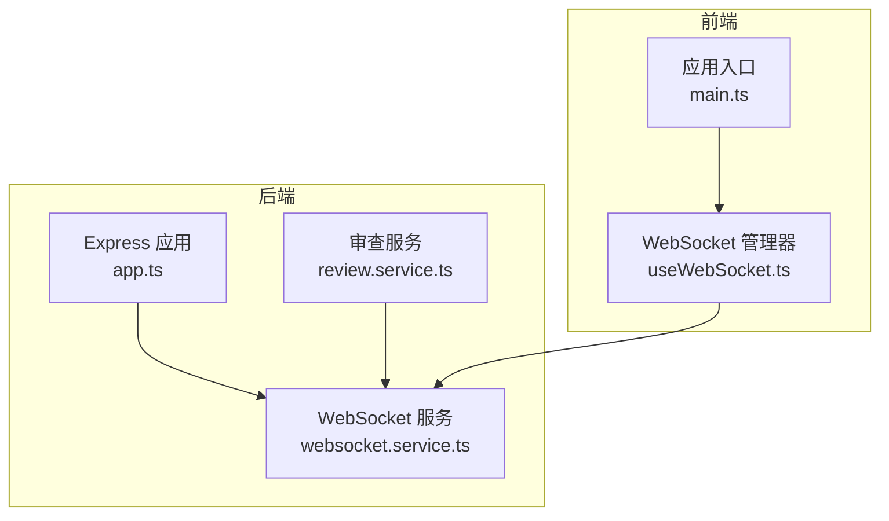
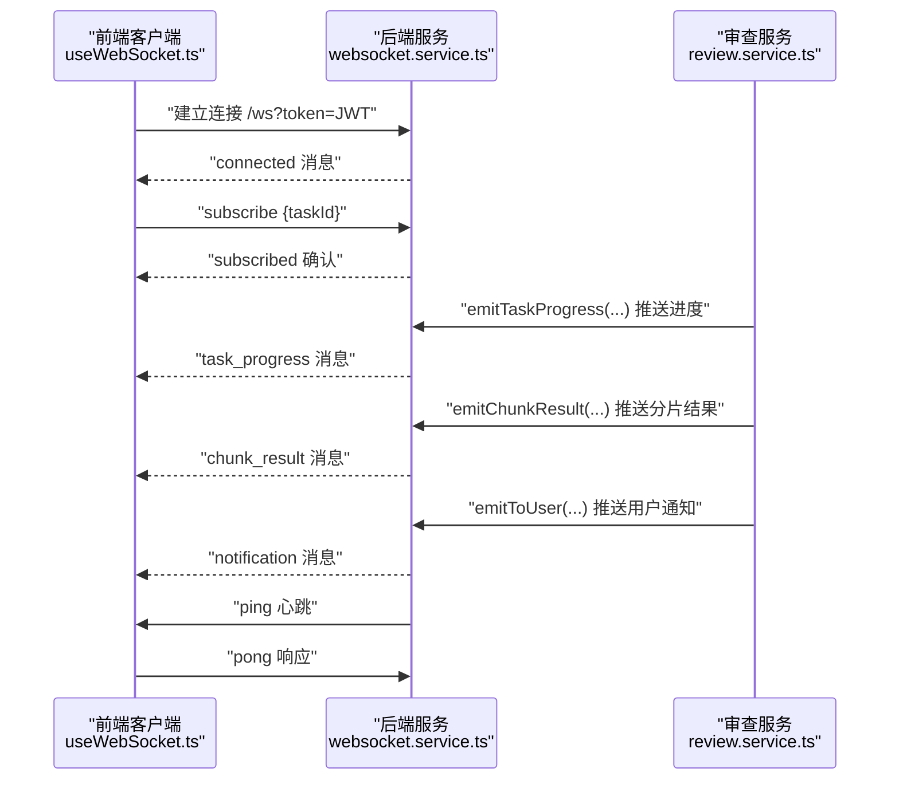
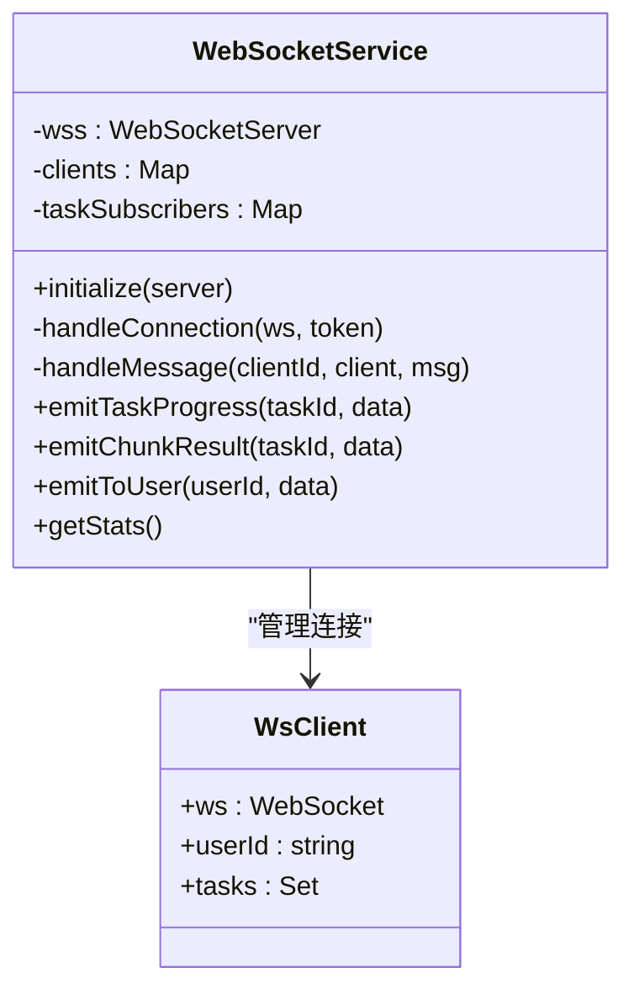
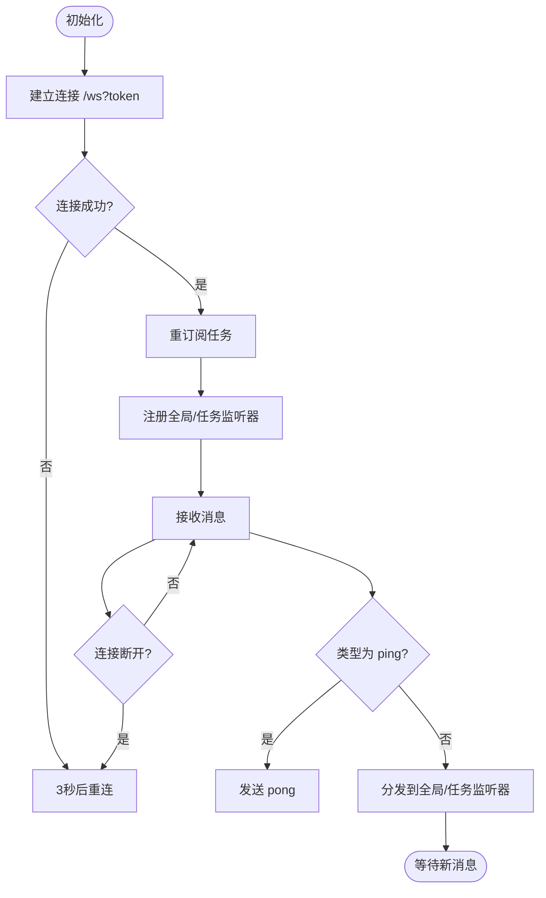
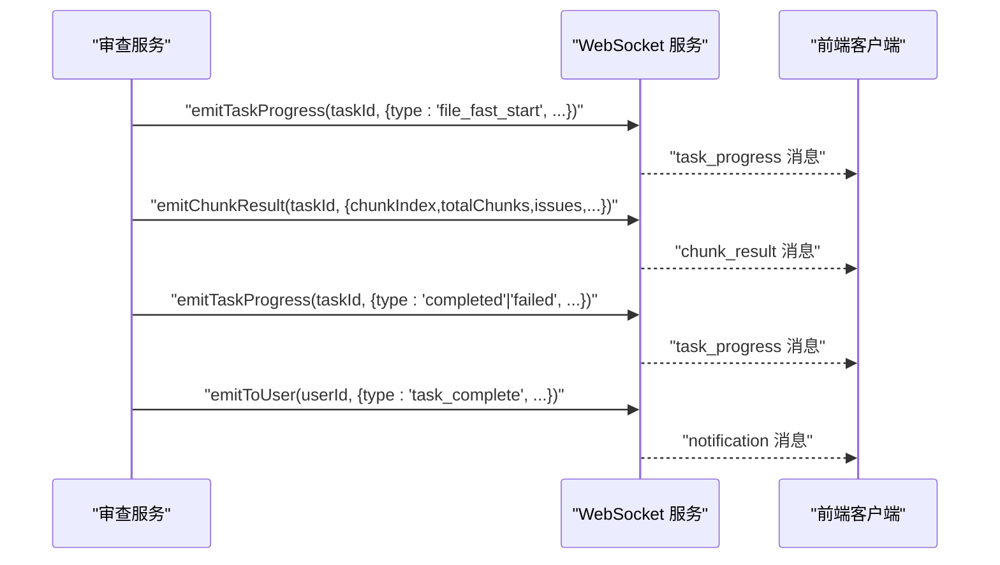
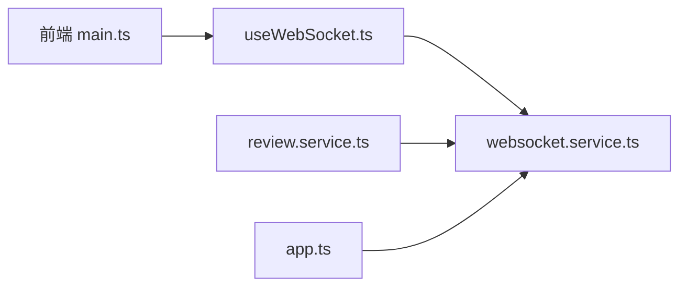

# 实时通信系统

<cite>
**本文档引用的文件**
- [websocket.service.ts](file://backend/src/services/websocket.service.ts)
- [useWebSocket.ts](file://frontend/src/composables/useWebSocket.ts)
- [review.service.ts](file://backend/src/services/review.service.ts)
- [app.ts](file://backend/src/app.ts)
- [main.ts](file://frontend/src/main.ts)
</cite>

## 目录
1. [简介](#简介)
2. [项目结构](#项目结构)
3. [核心组件](#核心组件)
4. [架构总览](#架构总览)
5. [详细组件分析](#详细组件分析)
6. [依赖关系分析](#依赖关系分析)
7. [性能考虑](#性能考虑)
8. [故障排查指南](#故障排查指南)
9. [结论](#结论)
10. [附录](#附录)

## 简介
本文件为“文件智能审查系统”的实时通信架构文档，聚焦于基于 WebSocket 的实时进度推送与事件处理机制。内容涵盖连接建立、消息协议、连接管理策略、事件处理模型、前端集成封装、消息格式设计、可靠性保障、性能优化以及监控与调试工具。

## 项目结构
- 后端采用 Node.js + Express + ws 提供 WebSocket 服务，路径为 /ws，并通过 JWT 进行鉴权。
- 前端使用 Vue Composable 封装 WebSocket 客户端，支持订阅任务进度、全局消息与断线重连。
- 审查服务在任务执行过程中通过 WebSocketService 主动推送进度与结果。

图表来源
- [app.ts:28-67](file://backend/src/app.ts#L28-L67)
- [websocket.service.ts:25-41](file://backend/src/services/websocket.service.ts#L25-L41)
- [review.service.ts:450-518](file://backend/src/services/review.service.ts#L450-L518)
- [main.ts:21-27](file://frontend/src/main.ts#L21-L27)
- [useWebSocket.ts:45-97](file://frontend/src/composables/useWebSocket.ts#L45-L97)

章节来源
- [app.ts:28-67](file://backend/src/app.ts#L28-L67)
- [websocket.service.ts:25-41](file://backend/src/services/websocket.service.ts#L25-L41)
- [main.ts:21-27](file://frontend/src/main.ts#L21-L27)

## 核心组件
- WebSocket 服务端：负责连接接入、JWT 鉴权、订阅管理、心跳保活、消息广播与统计。
- WebSocket 客户端：负责连接建立、订阅任务、接收消息、断线重连与事件分发。
- 审查服务：在任务生命周期内推送进度、阶段性结果与最终状态。

章节来源
- [websocket.service.ts:20-276](file://backend/src/services/websocket.service.ts#L20-L276)
- [useWebSocket.ts:37-150](file://frontend/src/composables/useWebSocket.ts#L37-L150)
- [review.service.ts:450-518](file://backend/src/services/review.service.ts#L450-L518)

## 架构总览
系统采用“服务端驱动、客户端订阅”的模式：
- 客户端通过携带 JWT 的查询参数连接 /ws。
- 客户端发送订阅请求以加入任务频道。
- 服务端在任务处理过程中主动推送进度、阶段性结果与最终状态。
- 心跳保活与断线重连确保连接稳定性。

图表来源
- [websocket.service.ts:25-92](file://backend/src/services/websocket.service.ts#L25-L92)
- [websocket.service.ts:94-121](file://backend/src/services/websocket.service.ts#L94-L121)
- [websocket.service.ts:177-218](file://backend/src/services/websocket.service.ts#L177-L218)
- [websocket.service.ts:127-172](file://backend/src/services/websocket.service.ts#L127-L172)
- [websocket.service.ts:223-244](file://backend/src/services/websocket.service.ts#L223-L244)
- [useWebSocket.ts:64-86](file://frontend/src/composables/useWebSocket.ts#L64-L86)
- [useWebSocket.ts:111-123](file://frontend/src/composables/useWebSocket.ts#L111-L123)
- [review.service.ts:450-518](file://backend/src/services/review.service.ts#L450-L518)

## 详细组件分析

### 后端 WebSocket 服务
- 连接接入与鉴权
  - 通过 /ws 路径接入，从 URL 查询参数读取 token，并使用 jwtSecret 进行验证。
  - 验证失败时关闭连接并返回错误码。
- 订阅管理
  - 客户端发送 subscribe/unsubscribe 消息，服务端维护任务到客户端集合的映射。
  - 断开或错误时清理订阅。
- 心跳保活
  - 每 30 秒向已认证客户端发送 ping，客户端需响应 pong。
- 消息推送
  - 任务进度：emitTaskProgress，推送 step、progress、message、result 等。
  - 分片结果：emitChunkResult，推送分片索引、问题数量与问题列表。
  - 用户通知：emitToUser，推送 notification 类型消息。
- 统计接口
  - getStats 返回连接数、订阅任务数与订阅任务列表，便于监控。

图表来源
- [websocket.service.ts:20-276](file://backend/src/services/websocket.service.ts#L20-L276)

章节来源
- [websocket.service.ts:25-92](file://backend/src/services/websocket.service.ts#L25-L92)
- [websocket.service.ts:94-121](file://backend/src/services/websocket.service.ts#L94-L121)
- [websocket.service.ts:127-244](file://backend/src/services/websocket.service.ts#L127-L244)
- [websocket.service.ts:268-275](file://backend/src/services/websocket.service.ts#L268-L275)

### 前端 WebSocket 客户端封装
- 连接建立
  - 从用户状态读取 token，构造 ws/wss 地址，建立连接。
  - 连接成功后触发 resubscribeTasks，重新订阅已有任务。
- 消息分发
  - 全局监听器：对所有消息进行回调。
  - 任务监听器：按 taskId 分发到对应回调集合。
- 心跳与断线重连
  - 接收 ping 后发送 pong；onclose 触发 3 秒延迟重连。
- 订阅管理
  - subscribe/unsubscribe 维护本地监听集合与已订阅任务集合。
  - 当连接恢复时自动重发订阅消息。

图表来源
- [useWebSocket.ts:45-97](file://frontend/src/composables/useWebSocket.ts#L45-L97)
- [useWebSocket.ts:111-145](file://frontend/src/composables/useWebSocket.ts#L111-L145)

章节来源
- [useWebSocket.ts:37-150](file://frontend/src/composables/useWebSocket.ts#L37-L150)

### 审查进度推送机制
- 任务阶段推进
  - 在审查流程中按阶段推送进度，包含 step、progress、message、timestamp 等。
- 分片增量结果
  - 每个 AI 分片完成后推送 chunk_result，包含分片索引、问题数量与问题列表，前端可增量渲染。
- 最终状态与通知
  - 任务完成后推送 completed/failed，并向任务创建者推送用户通知。

图表来源
- [review.service.ts:450-518](file://backend/src/services/review.service.ts#L450-L518)
- [websocket.service.ts:127-218](file://backend/src/services/websocket.service.ts#L127-L218)
- [websocket.service.ts:223-244](file://backend/src/services/websocket.service.ts#L223-L244)

章节来源
- [review.service.ts:450-518](file://backend/src/services/review.service.ts#L450-L518)

### 事件处理机制
- 事件类型
  - 订阅/取消订阅：subscribe、unsubscribe、subscribed、unsubscribed。
  - 心跳：ping、pong。
  - 进度：task_progress。
  - 分片：chunk_result。
  - 通知：notification。
- 事件处理器注册
  - 前端通过 onGlobalMessage 注册全局监听器；通过 subscribeTask 为特定 taskId 注册监听器。
- 事件传播策略
  - 服务端根据任务订阅表向订阅者广播；前端按 taskId 分发到对应监听器集合。

章节来源
- [websocket.service.ts:94-121](file://backend/src/services/websocket.service.ts#L94-L121)
- [useWebSocket.ts:64-86](file://frontend/src/composables/useWebSocket.ts#L64-L86)
- [useWebSocket.ts:135-138](file://frontend/src/composables/useWebSocket.ts#L135-L138)

### 消息格式设计
- 通用字段
  - type：消息类型（如 task_progress、chunk_result、notification、ping、pong、subscribe、unsubscribe）。
  - taskId：关联的任务标识（可选）。
  - timestamp：消息时间戳（可选）。
- 任务进度消息（task_progress）
  - progressType：进度类型（如阶段名或状态）。
  - step：当前步骤描述。
  - progress：百分比进度。
  - message：简要提示。
  - fileName：当前处理文件名（可选）。
  - result：结果数据（可选）。
- 分片结果消息（chunk_result）
  - fileId、fileName：文件标识。
  - chunkIndex、totalChunks：分片索引与总数。
  - issueCount：该分片问题数。
  - issues：问题数组（包含问题类型、严重程度、原文、建议、描述、标准引用、匹配信息等）。
  - engine：使用的引擎名称。
- 通知消息（notification）
  - notificationType：通知类型。
  - title、message：标题与正文。
  - timestamp：时间戳。
- 订阅确认消息
  - subscribed/unsubscribed：确认订阅/取消订阅，包含 taskId。

章节来源
- [websocket.service.ts:127-244](file://backend/src/services/websocket.service.ts#L127-L244)
- [useWebSocket.ts:5-25](file://frontend/src/composables/useWebSocket.ts#L5-L25)

### 可靠性保障
- 心跳保活
  - 服务端每 30 秒发送 ping；客户端收到后立即发送 pong。
- 断线重连
  - 前端 onclose 后延迟 3 秒重连，并在重连成功后自动重发订阅消息。
- 订阅幂等
  - 重复订阅不会产生重复推送；取消订阅后移除监听集合。
- 错误处理
  - 无效消息与发送异常会被忽略，避免影响整体连接。

章节来源
- [websocket.service.ts:73-80](file://backend/src/services/websocket.service.ts#L73-L80)
- [useWebSocket.ts:67-70](file://frontend/src/composables/useWebSocket.ts#L67-L70)
- [useWebSocket.ts:88-92](file://frontend/src/composables/useWebSocket.ts#L88-L92)

### 性能优化策略
- 连接池管理
  - 服务端按用户与任务维度维护订阅映射，避免全量广播带来的资源浪费。
- 消息压缩
  - 当前采用 JSON 文本传输；建议在网关或客户端启用 gzip 压缩（需后端配合）。
- 带宽控制
  - 采用增量推送（分片结果），减少单次消息体积；前端按需渲染。
- 心跳频率
  - 30 秒心跳频率适中，兼顾保活与网络负载。

章节来源
- [websocket.service.ts:127-218](file://backend/src/services/websocket.service.ts#L127-L218)
- [useWebSocket.ts:140-145](file://frontend/src/composables/useWebSocket.ts#L140-L145)

### 监控与调试工具
- 连接状态监控
  - 通过 getStats 获取 totalConnections、totalTaskSubscriptions、tasksWithSubscribers。
- 日志记录
  - 服务端在连接、订阅、推送与错误时输出日志，便于定位问题。
- 前端调试
  - 控制台输出连接状态、消息接收与错误信息；可在浏览器开发者工具 Network 面板查看 WebSocket 通信。

章节来源
- [websocket.service.ts:268-275](file://backend/src/services/websocket.service.ts#L268-L275)
- [useWebSocket.ts:58-61](file://frontend/src/composables/useWebSocket.ts#L58-L61)
- [useWebSocket.ts:94-96](file://frontend/src/composables/useWebSocket.ts#L94-L96)

## 依赖关系分析
- 后端依赖
  - ws：提供 WebSocket 服务器能力。
  - jsonwebtoken：校验 JWT。
  - prisma：用于任务状态更新与持久化（审查服务中使用）。
- 前端依赖
  - Vue：响应式状态与生命周期钩子。
  - Pinia：用户状态存储，提供 token。
- 应用入口
  - 后端 app.ts 注册路由与中间件；前端 main.ts 在路由切换时自动连接 WebSocket。

图表来源
- [main.ts:21-27](file://frontend/src/main.ts#L21-L27)
- [useWebSocket.ts:45-97](file://frontend/src/composables/useWebSocket.ts#L45-L97)
- [websocket.service.ts:25-41](file://backend/src/services/websocket.service.ts#L25-L41)
- [review.service.ts:450-518](file://backend/src/services/review.service.ts#L450-L518)
- [app.ts:28-67](file://backend/src/app.ts#L28-L67)

章节来源
- [app.ts:28-67](file://backend/src/app.ts#L28-L67)
- [main.ts:21-27](file://frontend/src/main.ts#L21-L27)

## 性能考虑
- 建议在网关层启用 WebSocket 压缩与限流，避免突发流量冲击。
- 对高频进度消息进行节流合并，降低前端渲染压力。
- 分片大小与推送频率需结合业务场景调优，避免频繁小包导致网络拥塞。

## 故障排查指南
- 连接失败
  - 检查 token 是否有效与过期；确认 /ws 路径与协议（ws/wss）正确。
- 无法接收消息
  - 确认已发送 subscribe 并收到 subscribed；检查前端监听器是否注册。
- 心跳中断
  - 检查网络环境与代理设置；确认客户端正确响应 pong。
- 任务未推送
  - 检查审查服务是否调用 emitTaskProgress/emitChunkResult；确认任务存在订阅者。

章节来源
- [websocket.service.ts:32-35](file://backend/src/services/websocket.service.ts#L32-L35)
- [useWebSocket.ts:117-120](file://frontend/src/composables/useWebSocket.ts#L117-L120)
- [review.service.ts:450-518](file://backend/src/services/review.service.ts#L450-L518)

## 结论
本系统通过简洁的消息协议与可靠的连接管理，实现了审查任务的实时进度与结果推送。前端采用轻量级封装，具备断线重连与订阅管理能力；后端以任务为中心进行订阅与广播，具备良好的扩展性与可观测性。后续可在网关层引入压缩与限流、优化分片粒度与推送频率，进一步提升性能与用户体验。

## 附录
- 前端集成要点
  - 登录成功后自动连接；路由切换时保持连接。
  - 为每个任务注册独立监听器，避免全局监听器负担过重。
- 后端部署要点
  - 正确配置 jwtSecret；在生产环境使用 wss 并启用 TLS。
  - 监控 getStats 输出，结合日志定位异常。