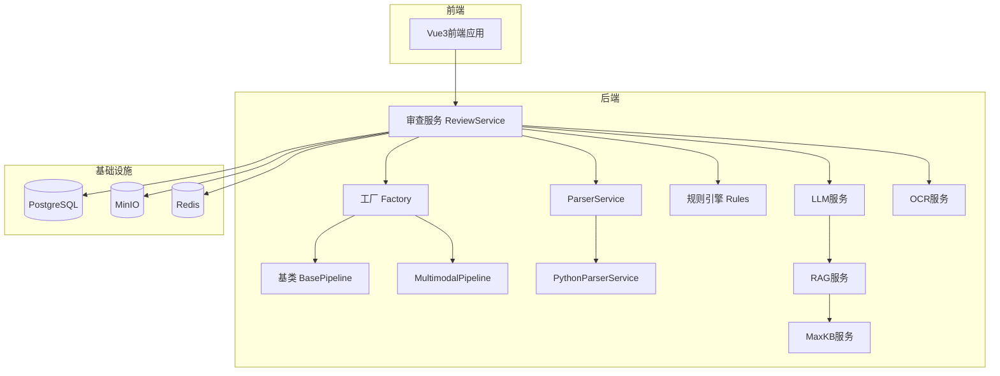
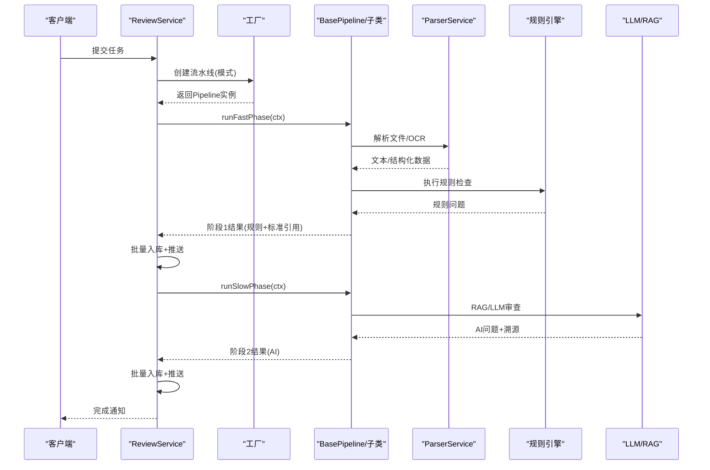
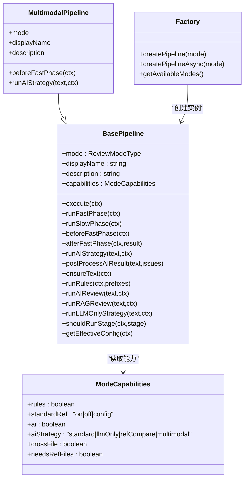
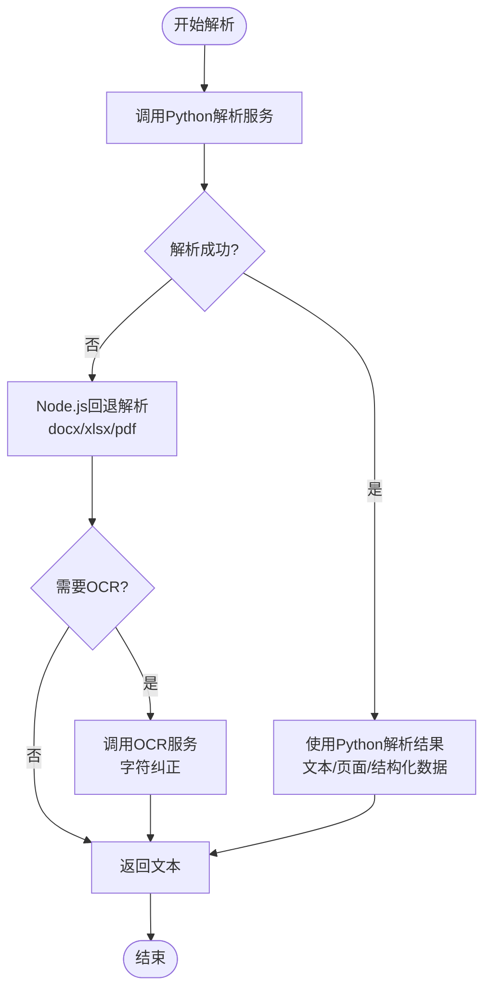
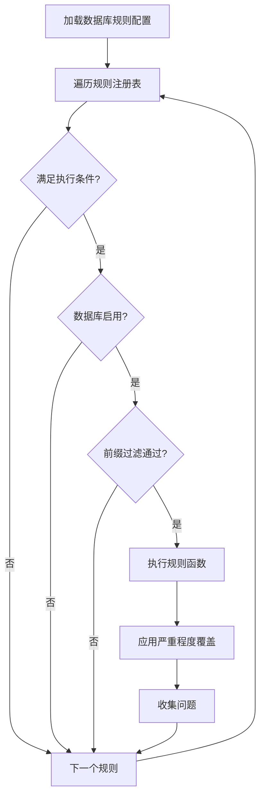
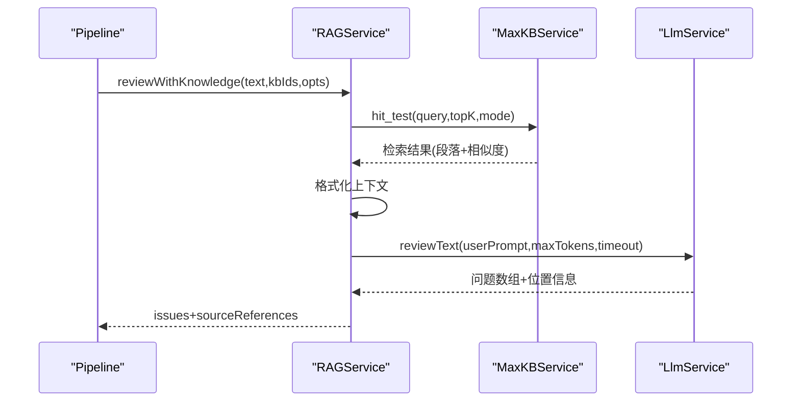
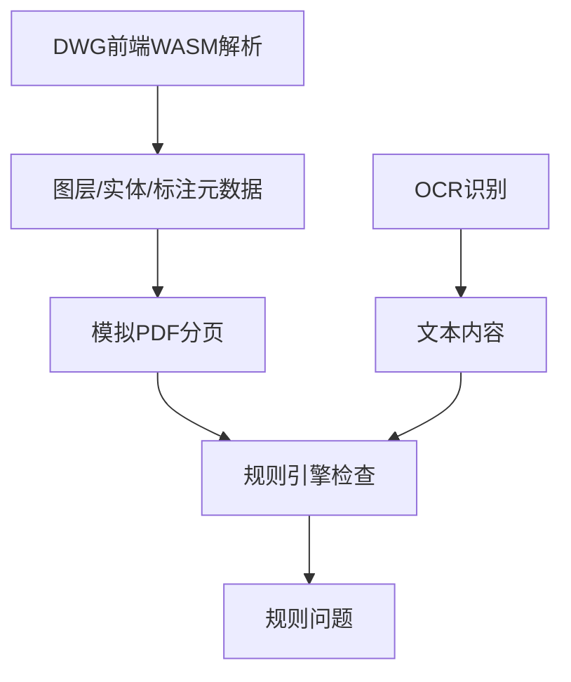
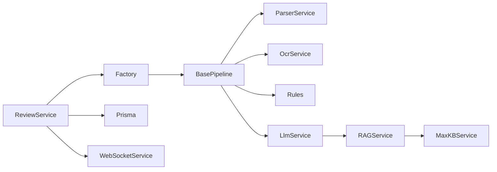

# 审查服务系统

<cite>
**本文档引用的文件**
- [文件智能审查系统_架构设计文档.md](file://docs/文件智能审查系统_架构设计文档.md)
- [base-pipeline.ts](file://backend/src/services/review-pipeline/base-pipeline.ts)
- [factory.ts](file://backend/src/services/review-pipeline/factory.ts)
- [multimodal.pipeline.ts](file://backend/src/services/review-pipeline/multimodal.pipeline.ts)
- [parser.service.ts](file://backend/src/services/parser.service.ts)
- [python-parser.service.ts](file://backend/src/services/python-parser.service.ts)
- [review.service.ts](file://backend/src/services/review.service.ts)
- [rules/index.ts](file://backend/src/services/rules/index.ts)
- [llm.service.ts](file://backend/src/services/llm.service.ts)
- [maxkb.service.ts](file://backend/src/services/maxkb.service.ts)
- [rag.service.ts](file://backend/src/services/rag.service.ts)
- [ocr.service.ts](file://backend/src/services/ocr.service.ts)
- [standard-check.service.ts](file://backend/src/services/standard-check.service.ts)
- [standard-extractor.service.ts](file://backend/src/services/standard-extractor.service.ts)
- [types.ts](file://backend/src/services/review-pipeline/types.ts)
- [mode-config.ts](file://backend/src/services/review-pipeline/mode-config.ts)
</cite>

## 目录
1. [简介](#简介)
2. [项目结构](#项目结构)
3. [核心组件](#核心组件)
4. [架构总览](#架构总览)
5. [详细组件分析](#详细组件分析)
6. [依赖关系分析](#依赖关系分析)
7. [性能考虑](#性能考虑)
8. [故障排查指南](#故障排查指南)
9. [结论](#结论)
10. [附录](#附录)

## 简介
本文件智能审查系统面向企业内网私有化部署，提供两阶段并发审查流水线、策略驱动的审查模式、多格式文件解析、规则引擎、AI审查（RAG/LLM）以及多模态处理能力。系统通过能力配置（ModeCapabilities）统一编排规则阶段与AI阶段，支持以库审文、以文审文、一致性、错别字语法、多模态、自定义规则、全量审查等多种模式，并提供DWG前端WASM解析、OCR降级、跨文件一致性检查、提示词工程与溯源等功能。

## 项目结构
后端采用TypeScript/Node.js实现，核心位于backend/src/services目录，包含审查流水线、规则引擎、解析服务、AI服务、RAG服务、OCR服务等模块。前端Vue3应用负责任务控制台、报告展示与CAD定位闭环。文档docs中提供了总体架构设计与实施路线。

**图表来源**
- [review.service.ts:120-518](file://backend/src/services/review.service.ts#L120-L518)
- [factory.ts:68-126](file://backend/src/services/review-pipeline/factory.ts#L68-L126)
- [base-pipeline.ts:37-134](file://backend/src/services/review-pipeline/base-pipeline.ts#L37-L134)
- [multimodal.pipeline.ts:32-41](file://backend/src/services/review-pipeline/multimodal.pipeline.ts#L32-L41)
- [parser.service.ts:15-89](file://backend/src/services/parser.service.ts#L15-L89)
- [python-parser.service.ts:76-174](file://backend/src/services/python-parser.service.ts#L76-L174)
- [rules/index.ts:21-35](file://backend/src/services/rules/index.ts#L21-L35)
- [llm.service.ts:46-68](file://backend/src/services/llm.service.ts#L46-L68)
- [rag.service.ts:59-110](file://backend/src/services/rag.service.ts#L59-L110)
- [maxkb.service.ts:53-128](file://backend/src/services/maxkb.service.ts#L53-L128)
- [ocr.service.ts:18-92](file://backend/src/services/ocr.service.ts#L18-L92)

**章节来源**
- [文件智能审查系统_架构设计文档.md:33-143](file://docs/文件智能审查系统_架构设计文档.md#L33-L143)

## 核心组件
- 审查流水线（策略模式）
  - BasePipeline：统一编排两阶段流程，提供钩子方法与能力配置驱动。
  - MultimodalPipeline：多模态专用策略，注入表格/公式检测与多模态LLM审查。
  - 工厂（Factory）：根据模式类型与运行时能力创建对应流水线实例。
- 文件解析服务
  - ParserService：优先调用Python解析微服务，失败时回退Node.js解析；支持docx/xlsx/pdf；DWG由前端WASM处理。
  - PythonParserService：调用独立解析微服务，返回结构化文本、页面、元数据与结构化数据。
- 规则引擎
  - rules/index.ts：规则注册与执行，按前缀过滤与数据库配置控制启用/严重程度。
- AI与RAG
  - LlmService：文本分片、JSON解析、位置信息、LLM调用。
  - RAGService：基于MaxKB向量检索的RAG审查，组装提示词并调用自有LLM。
  - MaxKBService：MaxKB集成、知识库管理、hit_test检索。
- OCR服务
  - OcrService：调用OCR模型进行图片/PDF识别，支持配置与后处理。
- 标准引用检查
  - StandardExtractorService：从文本/Excel列提取标准引用。
  - StandardCheckService：8级比对链与Levenshtein相似度匹配。
- 审查编排
  - ReviewService：两阶段并发编排、用户级并发控制、跨文件一致性检查、进度推送。

**章节来源**
- [base-pipeline.ts:37-134](file://backend/src/services/review-pipeline/base-pipeline.ts#L37-L134)
- [multimodal.pipeline.ts:32-41](file://backend/src/services/review-pipeline/multimodal.pipeline.ts#L32-L41)
- [factory.ts:68-126](file://backend/src/services/review-pipeline/factory.ts#L68-L126)
- [parser.service.ts:15-89](file://backend/src/services/parser.service.ts#L15-L89)
- [python-parser.service.ts:76-174](file://backend/src/services/python-parser.service.ts#L76-L174)
- [rules/index.ts:21-35](file://backend/src/services/rules/index.ts#L21-L35)
- [llm.service.ts:46-68](file://backend/src/services/llm.service.ts#L46-L68)
- [rag.service.ts:59-110](file://backend/src/services/rag.service.ts#L59-L110)
- [maxkb.service.ts:53-128](file://backend/src/services/maxkb.service.ts#L53-L128)
- [ocr.service.ts:18-92](file://backend/src/services/ocr.service.ts#L18-L92)
- [standard-extractor.service.ts:20-108](file://backend/src/services/standard-extractor.service.ts#L20-L108)
- [standard-check.service.ts:24-191](file://backend/src/services/standard-check.service.ts#L24-L191)
- [review.service.ts:120-518](file://backend/src/services/review.service.ts#L120-L518)

## 架构总览
系统采用“能力驱动”的流水线架构：通过ModeCapabilities声明每种模式的能力组合，BasePipeline统一编排阶段1（规则+标准引用）与阶段2（AI审查），并支持钩子扩展（如MultimodalPipeline的beforeFastPhase注入表格/公式检测）。工厂根据运行时能力创建流水线实例，ReviewService负责两阶段并发编排与用户级并发控制。

**图表来源**
- [review.service.ts:120-518](file://backend/src/services/review.service.ts#L120-L518)
- [factory.ts:108-126](file://backend/src/services/review-pipeline/factory.ts#L108-L126)
- [base-pipeline.ts:305-509](file://backend/src/services/review-pipeline/base-pipeline.ts#L305-L509)
- [parser.service.ts:49-89](file://backend/src/services/parser.service.ts#L49-L89)
- [rules/index.ts:222-266](file://backend/src/services/rules/index.ts#L222-L266)
- [llm.service.ts:487-601](file://backend/src/services/llm.service.ts#L487-L601)
- [rag.service.ts:144-269](file://backend/src/services/rag.service.ts#L144-L269)

## 详细组件分析

### 审查流水线（策略模式与能力驱动）
- 统一编排：BasePipeline定义execute/runFastPhase/runSlowPhase的统一流程，子类仅覆盖钩子与策略。
- 能力配置：MODE_CAPABILITIES定义各模式的能力组合，运行时可从数据库覆盖，工厂缓存以提升性能。
- 钩子扩展：beforeFastPhase注入额外规则问题（如表格/公式检测），runAIStrategy支持多模态/参照文件/纯LLM等策略。
- AI策略：runAIReview根据配置选择RAG/LLM/禁用，支持降级与进度回调。

**图表来源**
- [base-pipeline.ts:37-134](file://backend/src/services/review-pipeline/base-pipeline.ts#L37-L134)
- [multimodal.pipeline.ts:32-41](file://backend/src/services/review-pipeline/multimodal.pipeline.ts#L32-L41)
- [factory.ts:68-126](file://backend/src/services/review-pipeline/factory.ts#L68-L126)
- [mode-config.ts:16-30](file://backend/src/services/review-pipeline/mode-config.ts#L16-L30)

**章节来源**
- [base-pipeline.ts:37-134](file://backend/src/services/review-pipeline/base-pipeline.ts#L37-L134)
- [multimodal.pipeline.ts:32-41](file://backend/src/services/review-pipeline/multimodal.pipeline.ts#L32-L41)
- [factory.ts:68-126](file://backend/src/services/review-pipeline/factory.ts#L68-L126)
- [mode-config.ts:44-101](file://backend/src/services/review-pipeline/mode-config.ts#L44-L101)

### 文件解析服务（多格式支持与降级策略）
- 多格式支持：docx、xlsx、xls、pdf（Node.js回退：mammoth、xlsx、pdf-parse）。
- Python解析优先：通过PythonParserService调用独立解析微服务，返回结构化文本、页面、元数据与结构化数据。
- DWG处理：前端WASM解析，后端不再处理DWG，ParserService对DWG返回空文本并标记。
- OCR降级：当解析文本过短或PDF需OCR时，自动调用OCR服务并进行字符纠正。

**图表来源**
- [parser.service.ts:49-89](file://backend/src/services/parser.service.ts#L49-L89)
- [parser.service.ts:146-172](file://backend/src/services/parser.service.ts#L146-L172)
- [python-parser.service.ts:95-174](file://backend/src/services/python-parser.service.ts#L95-L174)
- [ocr.service.ts:56-92](file://backend/src/services/ocr.service.ts#L56-L92)

**章节来源**
- [parser.service.ts:15-89](file://backend/src/services/parser.service.ts#L15-L89)
- [parser.service.ts:146-172](file://backend/src/services/parser.service.ts#L146-L172)
- [python-parser.service.ts:76-174](file://backend/src/services/python-parser.service.ts#L76-L174)
- [ocr.service.ts:18-92](file://backend/src/services/ocr.service.ts#L18-L92)

### 规则引擎设计（规则定义、执行顺序与匹配算法）
- 规则注册：rules/index.ts集中注册规则函数与执行条件，按前缀映射。
- 执行顺序：按注册顺序遍历，先检查执行条件，再检查数据库启用状态与前缀过滤，最后应用严重程度覆盖。
- 规则前缀：如NAME、CODE、ATTR、HEADER、PAGE、FORMAT、COMPL、CONSIST、LAYOUT、TYPO、INTERNAL_CODE、DWG_*等。
- 标准引用检查：StandardExtractorService提取标准引用，StandardCheckService执行8级比对链与Levenshtein相似度。

**图表来源**
- [rules/index.ts:222-266](file://backend/src/services/rules/index.ts#L222-L266)
- [rules/index.ts:48-157](file://backend/src/services/rules/index.ts#L48-L157)
- [standard-extractor.service.ts:52-108](file://backend/src/services/standard-extractor.service.ts#L52-L108)
- [standard-check.service.ts:29-191](file://backend/src/services/standard-check.service.ts#L29-L191)

**章节来源**
- [rules/index.ts:21-35](file://backend/src/services/rules/index.ts#L21-L35)
- [rules/index.ts:222-266](file://backend/src/services/rules/index.ts#L222-L266)
- [standard-extractor.service.ts:20-108](file://backend/src/services/standard-extractor.service.ts#L20-L108)
- [standard-check.service.ts:24-191](file://backend/src/services/standard-check.service.ts#L24-L191)

### AI审查集成（RAG与LLM）
- RAG流程：RAGService检索相关段落，格式化上下文，按场景加载提示词，调用LLM审查并附加来源引用。
- LLM流程：LlmService分片文本、解析JSON/Markdown输出、添加位置信息，支持超时与分片进度回调。
- MaxKB集成：MaxKBService提供知识库管理、hit_test检索、文档管理与一键初始化。
- 多模态：MultimodalPipeline使用多模态场景提示词，重点检查表格/数值/公式。

**图表来源**
- [rag.service.ts:144-269](file://backend/src/services/rag.service.ts#L144-L269)
- [maxkb.service.ts:433-445](file://backend/src/services/maxkb.service.ts#L433-L445)
- [llm.service.ts:487-601](file://backend/src/services/llm.service.ts#L487-L601)
- [multimodal.pipeline.ts:84-158](file://backend/src/services/review-pipeline/multimodal.pipeline.ts#L84-L158)

**章节来源**
- [rag.service.ts:59-110](file://backend/src/services/rag.service.ts#L59-L110)
- [rag.service.ts:144-269](file://backend/src/services/rag.service.ts#L144-L269)
- [maxkb.service.ts:53-128](file://backend/src/services/maxkb.service.ts#L53-L128)
- [llm.service.ts:46-68](file://backend/src/services/llm.service.ts#L46-L68)
- [llm.service.ts:487-601](file://backend/src/services/llm.service.ts#L487-L601)
- [multimodal.pipeline.ts:84-158](file://backend/src/services/review-pipeline/multimodal.pipeline.ts#L84-L158)

### 多模态处理机制（文本、图像与CAD）
- 文本：表格结构化提取与验证、公式区域检测，注入规则问题。
- 图像：OCR服务支持图片/PDF识别，字符纠正减少误判。
- CAD：前端WASM解析DWG，后端接收结构化数据（图层、文本实体、尺寸标注、标准引用），模拟PDF分页供规则引擎使用。

**图表来源**
- [base-pipeline.ts:206-278](file://backend/src/services/review-pipeline/base-pipeline.ts#L206-L278)
- [multimodal.pipeline.ts:47-78](file://backend/src/services/review-pipeline/multimodal.pipeline.ts#L47-L78)
- [ocr.service.ts:56-92](file://backend/src/services/ocr.service.ts#L56-L92)

**章节来源**
- [base-pipeline.ts:206-278](file://backend/src/services/review-pipeline/base-pipeline.ts#L206-L278)
- [multimodal.pipeline.ts:47-78](file://backend/src/services/review-pipeline/multimodal.pipeline.ts#L47-L78)
- [ocr.service.ts:18-92](file://backend/src/services/ocr.service.ts#L18-L92)

### 审查结果处理（错误分类、严重程度与报告）
- 错误分类：issueType涵盖TYPO、VIOLATION、FORMAT、COMPLETENESS、CONSISTENCY、LAYOUT、NAMING、ENCODING、ATTRIBUTE、HEADER、PAGE等。
- 严重程度：规则引擎与数据库配置共同决定，支持覆盖。
- 位置信息：LlmService.findTextPosition基于分片计算字符偏移，支持前端定位。
- 溯源引用：RAG返回sourceReferences，每个问题可附加多来源片段。
- 报告生成：任务完成后批量入库并推送，前端导出Excel。

**章节来源**
- [llm.service.ts:17-36](file://backend/src/services/llm.service.ts#L17-L36)
- [llm.service.ts:446-467](file://backend/src/services/llm.service.ts#L446-L467)
- [rag.service.ts:249-254](file://backend/src/services/rag.service.ts#L249-L254)
- [review.service.ts:365-518](file://backend/src/services/review.service.ts#L365-L518)

## 依赖关系分析
- 模块耦合
  - ReviewService依赖工厂、流水线、解析、规则、LLM/RAG、OCR、数据库与消息推送。
  - BasePipeline依赖解析、OCR、规则引擎、LLM、MaxKB、RAG、提示词模板、标准检查、跨文件一致性。
  - 工厂依赖运行时能力配置，避免重复查询。
- 外部依赖
  - Python解析微服务、MaxKB、OCR模型API、PostgreSQL、Redis、MinIO。
- 循环依赖
  - 通过接口与类型定义避免循环导入；工厂与模式配置解耦。

**图表来源**
- [review.service.ts:1-20](file://backend/src/services/review.service.ts#L1-L20)
- [factory.ts:1-20](file://backend/src/services/review-pipeline/factory.ts#L1-L20)
- [base-pipeline.ts:21-35](file://backend/src/services/review-pipeline/base-pipeline.ts#L21-L35)
- [llm.service.ts:8-10](file://backend/src/services/llm.service.ts#L8-L10)
- [rag.service.ts:16-19](file://backend/src/services/rag.service.ts#L16-L19)
- [maxkb.service.ts:1-10](file://backend/src/services/maxkb.service.ts#L1-L10)

**章节来源**
- [review.service.ts:1-20](file://backend/src/services/review.service.ts#L1-L20)
- [factory.ts:1-20](file://backend/src/services/review-pipeline/factory.ts#L1-L20)
- [base-pipeline.ts:21-35](file://backend/src/services/review-pipeline/base-pipeline.ts#L21-L35)

## 性能考虑
- 两阶段并发：阶段1规则并行、阶段2AI按用户并发限制，显著缩短总时延。
- 文本分片：LlmService.splitText按段落与句子切分，控制LLM输入长度，提高吞吐。
- 缓存与降级：工厂缓存运行时能力、Python解析服务健康检查、RAG检索结果可缓存（建议）。
- 资源保护：用户级并发控制、LLM/RAG超时、OCR超时，避免资源耗尽。
- 存储与网络：MinIO直传直存、预签名URL、Redis缓存提升I/O效率。

[本节为通用指导，无需特定文件引用]

## 故障排查指南
- Python解析服务不可用
  - 现象：ParserService回退到Node.js解析或抛出连接拒绝。
  - 排查：检查服务URL配置、健康检查、日志。
  - 参考
    - [python-parser.service.ts:80-90](file://backend/src/services/python-parser.service.ts#L80-L90)
    - [python-parser.service.ts:165-174](file://backend/src/services/python-parser.service.ts#L165-L174)
- OCR失败
  - 现象：PDF/图片无法提取文本。
  - 排查：检查OCR配置、API Key、超时设置、后处理字符纠正。
  - 参考
    - [ocr.service.ts:22-48](file://backend/src/services/ocr.service.ts#L22-L48)
    - [ocr.service.ts:118-184](file://backend/src/services/ocr.service.ts#L118-L184)
- LLM/RAG调用异常
  - 现象：超时、返回非JSON、提示词加载失败。
  - 排查：检查模型配置、系统提示词模板、分片大小与超时。
  - 参考
    - [llm.service.ts:503-523](file://backend/src/services/llm.service.ts#L503-L523)
    - [llm.service.ts:524-601](file://backend/src/services/llm.service.ts#L524-L601)
    - [rag.service.ts:170-269](file://backend/src/services/rag.service.ts#L170-L269)
- 标准引用匹配不准确
  - 现象：匹配级别偏低或相似度不足。
  - 排查：检查标准化处理（去空格、标点、大写）、Levenshtein阈值。
  - 参考
    - [standard-extractor.service.ts:52-108](file://backend/src/services/standard-extractor.service.ts#L52-L108)
    - [standard-check.service.ts:167-191](file://backend/src/services/standard-check.service.ts#L167-L191)

**章节来源**
- [python-parser.service.ts:80-90](file://backend/src/services/python-parser.service.ts#L80-L90)
- [python-parser.service.ts:165-174](file://backend/src/services/python-parser.service.ts#L165-L174)
- [ocr.service.ts:22-48](file://backend/src/services/ocr.service.ts#L22-L48)
- [ocr.service.ts:118-184](file://backend/src/services/ocr.service.ts#L118-L184)
- [llm.service.ts:503-523](file://backend/src/services/llm.service.ts#L503-L523)
- [llm.service.ts:524-601](file://backend/src/services/llm.service.ts#L524-L601)
- [rag.service.ts:170-269](file://backend/src/services/rag.service.ts#L170-L269)
- [standard-extractor.service.ts:52-108](file://backend/src/services/standard-extractor.service.ts#L52-L108)
- [standard-check.service.ts:167-191](file://backend/src/services/standard-check.service.ts#L167-L191)

## 结论
本审查服务系统通过“能力驱动”的流水线架构实现了高度可配置与可扩展的审查能力。两阶段并发编排兼顾速度与深度，规则引擎与AI审查互补，多模态处理覆盖文本、图像与CAD。工厂与模式配置解耦了行为差异，便于维护与演进。建议持续优化分片策略、缓存命中率与提示词质量，以进一步提升性能与准确性。

[本节为总结，无需特定文件引用]

## 附录
- 审查模式与能力对照
  - LIBRARY_REVIEW：规则+标准引用+AI，标准模式。
  - DOC_REVIEW：规则+标准引用+参照比对，需要参照文件。
  - CONSISTENCY/FULL_REVIEW：规则+标准引用+AI+跨文件。
  - TYPO_GRAMMAR：规则+AI(纯LLM)+术语过滤。
  - MULTIMODAL：规则+表格/公式+多模态LLM。
  - CUSTOM_RULE：仅规则引擎。
- 关键类型与配置
  - PipelineContext：文件上下文，包含文本、页面、结构化数据、知识库ID、进度回调等。
  - PipelineReviewConfig：全局流水线配置，包含AI引擎策略、分片大小、并发限制等。

**章节来源**
- [mode-config.ts:44-101](file://backend/src/services/review-pipeline/mode-config.ts#L44-L101)
- [types.ts:82-129](file://backend/src/services/review-pipeline/types.ts#L82-L129)
- [types.ts:32-43](file://backend/src/services/review-pipeline/types.ts#L32-L43)