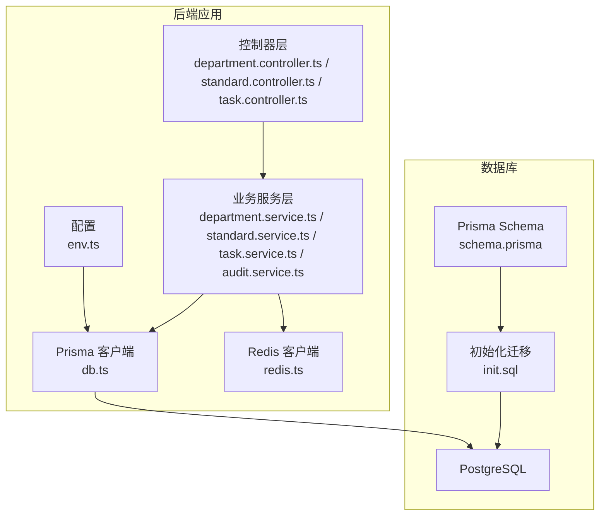
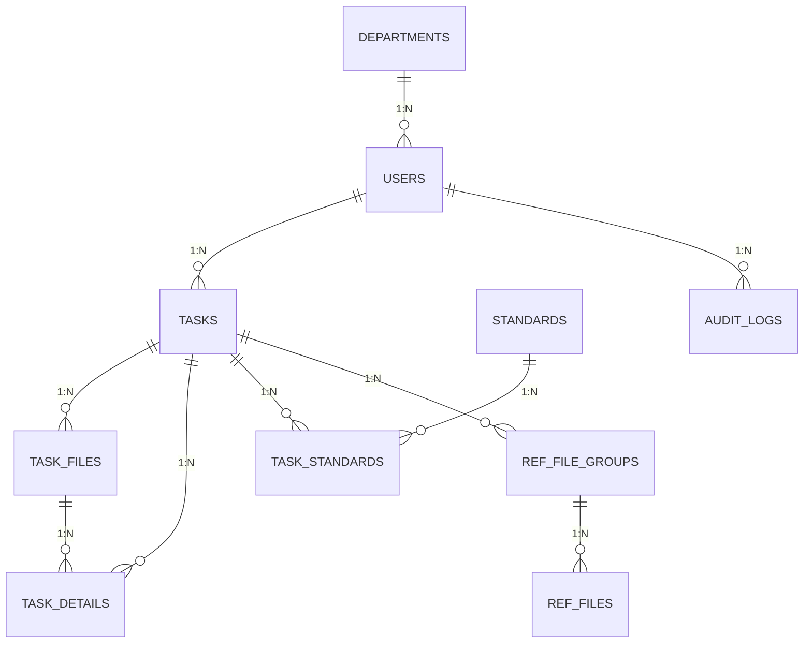
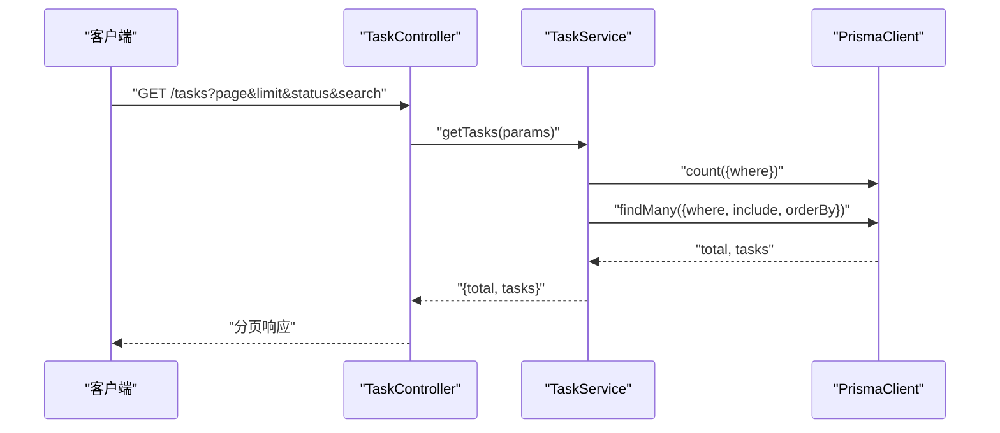
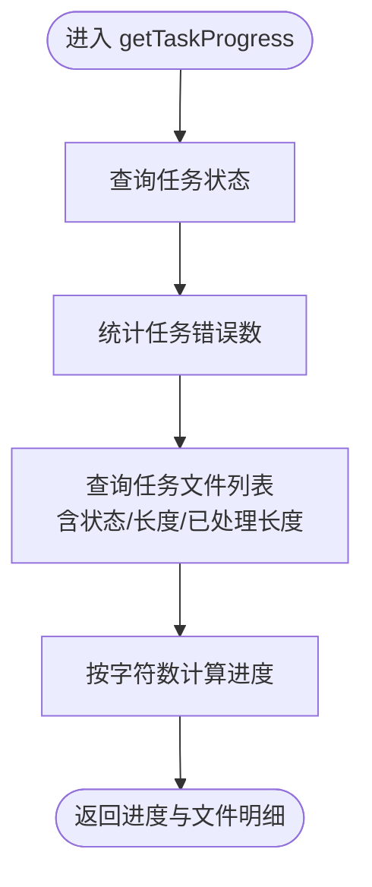
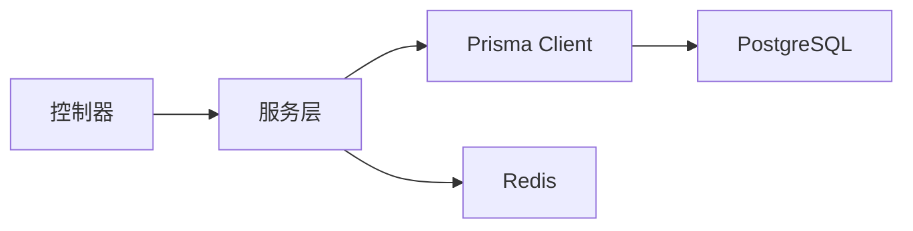

# 数据库设计

<cite>
**本文引用的文件**
- [schema.prisma](file://backend/prisma/schema.prisma)
- [init.sql](file://backend/prisma/migrations/init.sql)
- [db.ts](file://backend/src/config/db.ts)
- [env.ts](file://backend/src/config/env.ts)
- [department.service.ts](file://backend/src/services/department.service.ts)
- [standard.service.ts](file://backend/src/services/standard.service.ts)
- [task.service.ts](file://backend/src/services/task.service.ts)
- [audit.service.ts](file://backend/src/services/audit.service.ts)
- [department.controller.ts](file://backend/src/controllers/department.controller.ts)
- [standard.controller.ts](file://backend/src/controllers/standard.controller.ts)
- [task.controller.ts](file://backend/src/controllers/task.controller.ts)
- [redis.ts](file://backend/src/utils/redis.ts)
- [package.json](file://backend/package.json)
</cite>

## 目录
1. [简介](#简介)
2. [项目结构](#项目结构)
3. [核心组件](#核心组件)
4. [架构总览](#架构总览)
5. [详细组件分析](#详细组件分析)
6. [依赖分析](#依赖分析)
7. [性能考量](#性能考量)
8. [故障排查指南](#故障排查指南)
9. [结论](#结论)
10. [附录](#附录)

## 简介
本文件为“文件智能审查系统”的数据库设计文档，基于 Prisma ORM 的数据模型与迁移机制，围绕 Department、User、Standard、Task、TaskFile、TaskDetail、AuditLog、SystemConfig 等核心实体，给出数据模型关系图、表结构定义、索引策略、迁移与版本管理、性能优化、数据访问模式、数据生命周期管理、安全设计以及模型演进与兼容性建议。

## 项目结构
后端采用 TypeScript + Express + Prisma 的技术栈，数据库为 PostgreSQL。Prisma Schema 描述了数据模型与关系，迁移脚本位于 prisma/migrations 目录，运行时通过 Prisma Client 访问数据库。

图表来源
- [db.ts:1-6](file://backend/src/config/db.ts#L1-L6)
- [env.ts:1-14](file://backend/src/config/env.ts#L1-L14)
- [schema.prisma:1-343](file://backend/prisma/schema.prisma#L1-L343)
- [init.sql:1-107](file://backend/prisma/migrations/init.sql#L1-L107)

章节来源
- [db.ts:1-6](file://backend/src/config/db.ts#L1-L6)
- [env.ts:1-14](file://backend/src/config/env.ts#L1-L14)
- [schema.prisma:1-343](file://backend/prisma/schema.prisma#L1-L343)
- [init.sql:1-107](file://backend/prisma/migrations/init.sql#L1-L107)

## 核心组件
- Department：组织架构树，支持父子关系与用户归属。
- User：系统用户，归属部门，具备角色（ADMIN/MANAGER/USER）。
- Standard：标准库条目，支持文件夹分类、状态与来源标记。
- Task：审查任务，关联创建者、标准、文件与审查细节。
- TaskFile：任务内文件，缓存解析文本与 DWG 元数据。
- TaskDetail：审查结果明细，支持误报标记与溯源信息。
- AuditLog：审计日志，记录用户操作与资源变更。
- SystemConfig：系统配置键值对（JSON 值）。
- ReviewRule：审查规则（额外模型，用于规则引擎）。
- TaskStandard：任务与标准的多对多关联。
- RefFileGroup/RefFile：以文审文模式的参照文件组与文件。
- TerminologyWhitelist/PromptTemplate/FalsePositiveLibrary/TempStandardEntry：扩展模型，支撑术语白名单、提示词模板、误报库与临时标准库。

章节来源
- [schema.prisma:10-343](file://backend/prisma/schema.prisma#L10-L343)

## 架构总览
下图展示核心实体之间的关系与外键约束，体现典型的“任务-文件-结果”链路与“标准-任务”关联。

图表来源
- [schema.prisma:10-343](file://backend/prisma/schema.prisma#L10-L343)

## 详细组件分析

### 数据模型与表结构定义
以下为关键实体的字段、类型、约束与索引策略的归纳（基于 Prisma Schema 与迁移脚本）：

- Department
  - 字段：id、name、parentId、createdAt、updatedAt
  - 约束：主键；自引用外键（SET NULL）
  - 索引：无显式索引（可按需要增加）
  - 复杂度：树遍历 O(n)，构建树 O(n)

- User
  - 字段：id、username（唯一）、passwordHash、name、email、role（默认 USER）、departmentId、createdAt、updatedAt
  - 约束：主键；username 唯一；外键到 Department
  - 索引：username 唯一索引（迁移脚本）

- Standard
  - 字段：id、title、version、isActive（默认 true）、standardNo、standardName、standardIdent、standardStatus（默认 CURRENT）、publishDate、implementDate、abolishDate、folderId、maxkbDocId、source、importedBy、createdAt、updatedAt
  - 约束：主键；folderId 外键到 StandardFolder
  - 索引：无显式索引（可按搜索与状态查询增加）

- StandardFolder
  - 字段：id、name、parentId、children（自引用）、createdAt、updatedAt
  - 约束：主键；自引用外键（SET NULL）
  - 索引：无显式索引

- Task
  - 字段：id、title、description、status（默认 PENDING）、reviewMode（默认 FULL_REVIEW）、creatorId、standardId、maxkbKnowledgeId、createdAt、updatedAt
  - 约束：主键；外键到 User（creator）、Standard
  - 索引：无显式索引

- TaskFile
  - 字段：id、taskId、fileName、filePath、fileSize（默认 0）、fileType、status（默认 PENDING）、textLength（默认 0）、processedLength（默认 0）、errorCount（默认 0）、extractedText（缓存文本）、extractedMarkdown（缓存 Markdown）、dwgMetadata（DWG 元数据）、createdAt
  - 约束：主键；外键到 Task（CASCADE 删除）
  - 索引：无显式索引

- TaskDetail
  - 字段：id、taskId、fileId、issueType、ruleCode、severity（默认 warning）、originalText、suggestedText、description、cadHandleId、createdAt、updatedAt、diffRanges、matchLevel、similarity、standardRefId、standardRef、isFalsePositive（默认 false）、fpMarkedBy、fpMarkedAt、fpReason、sourceReferences、textPosition、dwgMetadata
  - 约束：主键；外键到 Task（CASCADE 删除）；可选外键到 TaskFile
  - 索引：无显式索引

- AuditLog
  - 字段：id、action、resource、details（JSON）、userId、ipAddress、createdAt
  - 约束：主键；外键到 User（SET NULL）
  - 索引：无显式索引

- SystemConfig
  - 字段：id、key（唯一）、value（JSON）、createdAt、updatedAt
  - 约束：主键；key 唯一
  - 索引：key 唯一索引（Prisma 保证）

- ReviewRule
  - 字段：id、ruleCode（唯一）、name、category、description、severity（默认 warning）、enabled（默认 true）、config（JSON）、createdAt、updatedAt
  - 约束：主键；ruleCode 唯一
  - 索引：无显式索引

- TaskStandard
  - 字段：id、taskId、standardId、createdAt
  - 约束：主键；唯一索引（taskId, standardId）；外键 CASCADE
  - 索引：唯一复合索引

- RefFileGroup
  - 字段：id、taskId、groupName（默认 “默认参照组”）、description、createdAt
  - 约束：主键；外键到 Task（CASCADE 删除）
  - 索引：无显式索引

- RefFile
  - 字段：id、groupId、fileName、filePath、fileSize、fileType、extractedText（缓存）、createdAt
  - 约束：主键；外键到 RefFileGroup（CASCADE 删除）
  - 索引：无显式索引

- TerminologyWhitelist
  - 字段：id、term、category、aliases、isBuiltin（默认 false）、createdBy、createdAt、updatedAt
  - 约束：主键；唯一索引（term, category）
  - 索引：无显式索引

- PromptTemplate
  - 字段：id、key（唯一）、module、role、variant（默认 default）、name、description、content、placeholders、defaultValue、isBuiltin（默认 true）、enabled（默认 true）、createdAt、updatedAt
  - 约束：主键；key 唯一
  - 索引：无显式索引

- FalsePositiveLibrary
  - 字段：id、originalText、fpReason、issueType、ruleCode、severity、markedById、markedByName、taskId、taskTitle、count（默认 1）、lastMarkedAt（默认 now）、createdAt、updatedAt
  - 约束：主键
  - 索引：对 originalText、issueType、lastMarkedAt 建立索引（Prisma 定义）

- TempStandardEntry
  - 字段：id、userId、standardNo、standardName、standardIdent、rawText、sourceFile、importType（默认 excel）、createdAt
  - 约束：主键
  - 索引：对 userId 建立索引（Prisma 定义）

章节来源
- [schema.prisma:10-343](file://backend/prisma/schema.prisma#L10-L343)
- [init.sql:1-107](file://backend/prisma/migrations/init.sql#L1-L107)

### 数据访问模式与事务管理
- 访问模式
  - 服务层封装 CRUD 与复杂查询，控制器负责请求参数解析与响应包装。
  - 使用 Prisma Client 进行类型安全的数据访问。
- 事务
  - 当前服务层未显式使用事务块；涉及多表写入（如任务创建时写入 Task、TaskFile、TaskStandard）可考虑在服务层包裹事务以保证一致性。
- 连接池
  - 未在代码中显式配置连接池参数；可通过 Prisma 的 datasource 参数或环境变量进行调整（例如 pool_timeout、connect_timeout 等）。

章节来源
- [department.service.ts:1-113](file://backend/src/services/department.service.ts#L1-L113)
- [standard.service.ts:1-1021](file://backend/src/services/standard.service.ts#L1-L1021)
- [task.service.ts:1-699](file://backend/src/services/task.service.ts#L1-L699)
- [audit.service.ts:1-152](file://backend/src/services/audit.service.ts#L1-L152)
- [department.controller.ts:1-66](file://backend/src/controllers/department.controller.ts#L1-L66)
- [standard.controller.ts:1-387](file://backend/src/controllers/standard.controller.ts#L1-L387)
- [task.controller.ts:1-413](file://backend/src/controllers/task.controller.ts#L1-L413)
- [db.ts:1-6](file://backend/src/config/db.ts#L1-L6)

### 查询流程示例（任务列表）

图表来源
- [task.controller.ts:76-109](file://backend/src/controllers/task.controller.ts#L76-L109)
- [task.service.ts:161-232](file://backend/src/services/task.service.ts#L161-L232)
- [db.ts:1-6](file://backend/src/config/db.ts#L1-L6)

### 复杂逻辑流程（任务进度计算）

图表来源
- [task.service.ts:307-353](file://backend/src/services/task.service.ts#L307-L353)

## 依赖分析
- Prisma 与 PostgreSQL
  - Prisma 作为 ORM，Schema 定义模型，迁移脚本初始化数据库结构。
- 运行时依赖
  - Prisma Client、dotenv、ioredis 等。
- 控制器-服务-数据层
  - 控制器接收请求，服务层执行业务逻辑，Prisma 访问数据库；部分服务使用 Redis 缓存。

图表来源
- [package.json:17-58](file://backend/package.json#L17-L58)
- [db.ts:1-6](file://backend/src/config/db.ts#L1-L6)
- [redis.ts:1-51](file://backend/src/utils/redis.ts#L1-L51)

章节来源
- [package.json:17-58](file://backend/package.json#L17-L58)
- [db.ts:1-6](file://backend/src/config/db.ts#L1-L6)
- [redis.ts:1-51](file://backend/src/utils/redis.ts#L1-L51)

## 性能考量
- 查询优化
  - 对高频过滤字段（如 Task.status、Task.creatorId、TaskDetail.issueType、AuditLog.userId、Standard.standardNo/standardName 等）建立索引。
  - 对分页查询使用合适的排序键（如 createdAt DESC）并配合覆盖索引。
- 索引设计
  - 建议索引：users_username_key（已存在）、audit_logs_userId、task_details_taskId、task_files_taskId、task_details_fileId、task_standard_taskId_standardId（唯一索引已存在）、false_positive_library_originalText、false_positive_library_issueType、false_positive_library_lastMarkedAt、temp_standard_entries_userId。
- 缓存策略
  - 使用 Redis 缓存热点配置与临时标准库（服务层已有内存缓存，可结合 Redis 做分布式缓存）。
- 连接池与并发
  - 通过 Prisma datasource 参数配置连接池超时与并发；生产环境建议限制最大连接数并开启 keep-alive。
- 数据库迁移
  - 使用 Prisma Migrate 管理结构变更；每次变更生成迁移文件并记录版本；回滚通过 down 操作或创建新迁移修正。

章节来源
- [schema.prisma:321-342](file://backend/prisma/schema.prisma#L321-L342)
- [init.sql:89-105](file://backend/prisma/migrations/init.sql#L89-L105)
- [redis.ts:1-51](file://backend/src/utils/redis.ts#L1-L51)

## 故障排查指南
- 审计日志查询
  - 支持按 action、resource、userId、时间范围筛选，并可导出 CSV。
- 常见问题
  - 部门删除失败：若存在子部门或用户绑定，将抛出错误。
  - 标准删除：若关联 MaxKB 文档，服务层会尝试清理。
  - 任务进度：按文件字符数与处理状态计算，确保字段完整性。
- 日志与监控
  - 审计服务记录关键操作；Redis 连接错误事件已注册监听。

章节来源
- [audit.service.ts:1-152](file://backend/src/services/audit.service.ts#L1-L152)
- [department.service.ts:87-109](file://backend/src/services/department.service.ts#L87-L109)
- [standard.service.ts:238-250](file://backend/src/services/standard.service.ts#L238-L250)
- [task.service.ts:307-353](file://backend/src/services/task.service.ts#L307-L353)
- [redis.ts:13-19](file://backend/src/utils/redis.ts#L13-L19)

## 结论
本数据库设计以 Prisma Schema 为核心，围绕任务驱动的审查流程构建了清晰的实体关系。通过合理的索引与缓存策略可显著提升查询性能；借助 Prisma 迁移机制保障结构演进的可控性。建议在关键写入路径引入事务，并完善监控与告警，持续优化查询与索引策略。

## 附录

### 数据库迁移策略
- 迁移机制
  - 使用 Prisma Migrate 管理结构变更；每次变更生成迁移文件并记录版本。
- 版本管理
  - 迁移文件按时间戳命名，确保顺序与幂等；通过 prisma migrate dev/resolve/status 等命令维护。
- 回滚策略
  - 使用 prisma migrate resolve --applied 或 --rolled-back；必要时编写反向迁移修正错误变更。

章节来源
- [schema.prisma:1-343](file://backend/prisma/schema.prisma#L1-L343)
- [init.sql:1-107](file://backend/prisma/migrations/init.sql#L1-L107)

### 数据生命周期管理
- 归档与清理
  - 标准库：通过状态字段（CURRENT/UPCOMING/ABOLISHED）与日期字段管理生命周期。
  - 临时标准库：支持导入、查询、清空与归档为正式标准。
  - 审计日志：建议按时间维度归档与清理。
- 备份与恢复
  - 建议定期进行逻辑备份（pg_dump）与物理备份；结合 Docker Compose 配置持久化卷。

章节来源
- [standard.service.ts:610-671](file://backend/src/services/standard.service.ts#L610-L671)
- [audit.service.ts:83-150](file://backend/src/services/audit.service.ts#L83-L150)

### 数据安全设计
- 敏感数据保护
  - 用户密码使用哈希存储；审计日志记录操作但不存储明文敏感信息。
- 访问控制
  - 控制器层结合 RBAC 中间件进行数据可见性过滤。
- 审计追踪
  - 审计日志记录操作、资源、用户与 IP，支持导出与检索。

章节来源
- [standard.controller.ts:1-387](file://backend/src/controllers/standard.controller.ts#L1-L387)
- [task.controller.ts:1-413](file://backend/src/controllers/task.controller.ts#L1-L413)
- [audit.service.ts:1-152](file://backend/src/services/audit.service.ts#L1-L152)

### 数据模型演进与兼容性
- 向后兼容
  - 新增字段建议设置默认值；枚举新增值需兼容旧数据；避免删除关键字段。
- 模式演进
  - 通过 Prisma 迁移逐步演进；对大表变更使用在线DDL或分批处理。
- 建议
  - 对历史数据进行清洗与补全；对常用查询建立合适索引；定期评估查询计划与索引使用情况。

章节来源
- [schema.prisma:40-126](file://backend/prisma/schema.prisma#L40-L126)
- [standard.service.ts:17-42](file://backend/src/services/standard.service.ts#L17-L42)