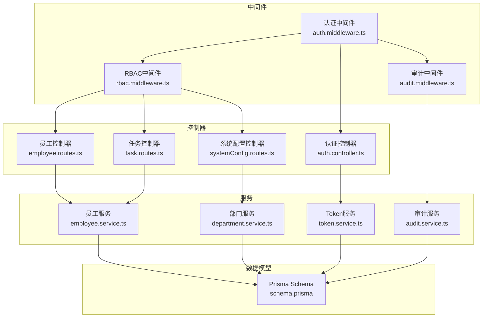
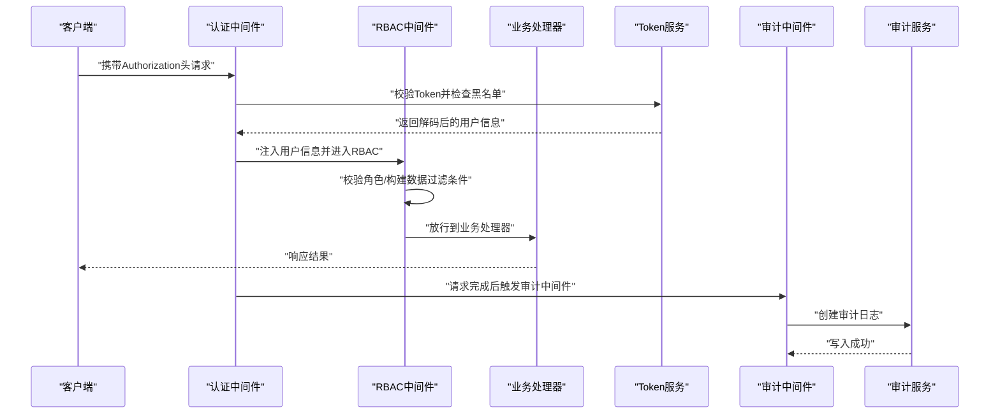
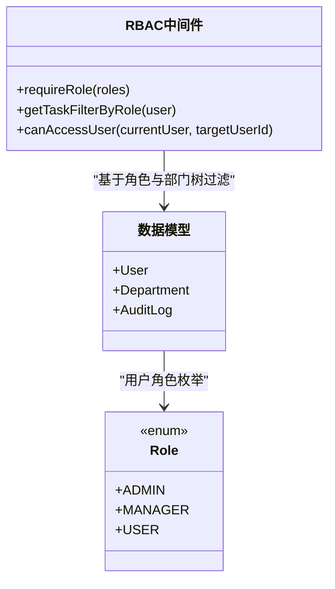
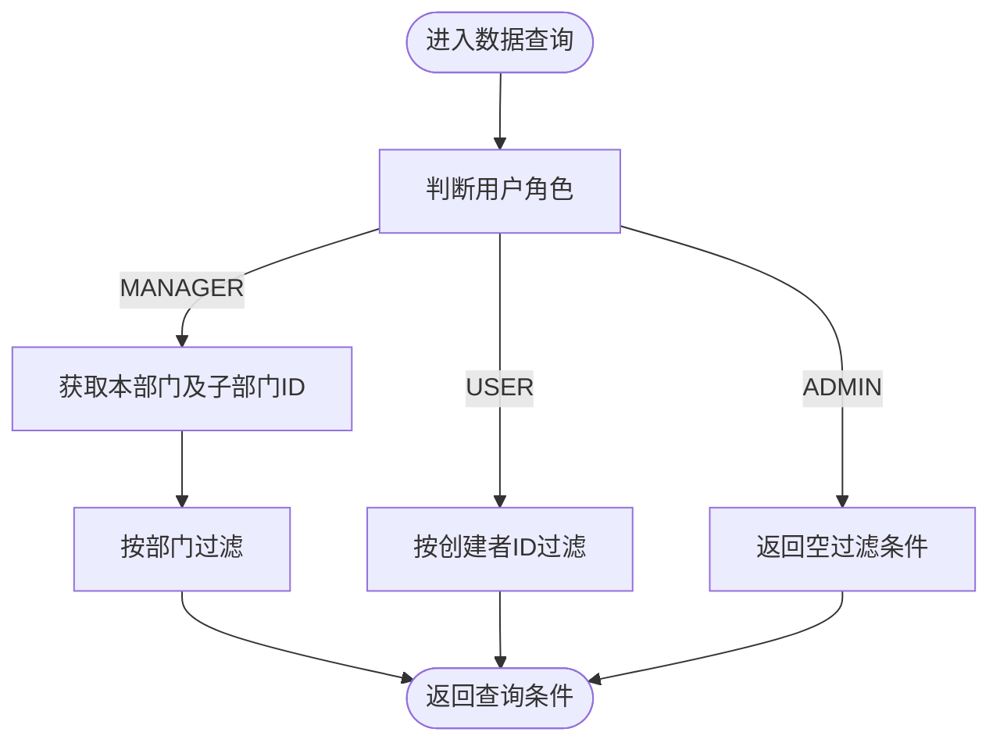
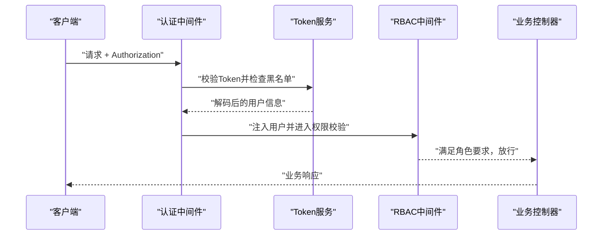
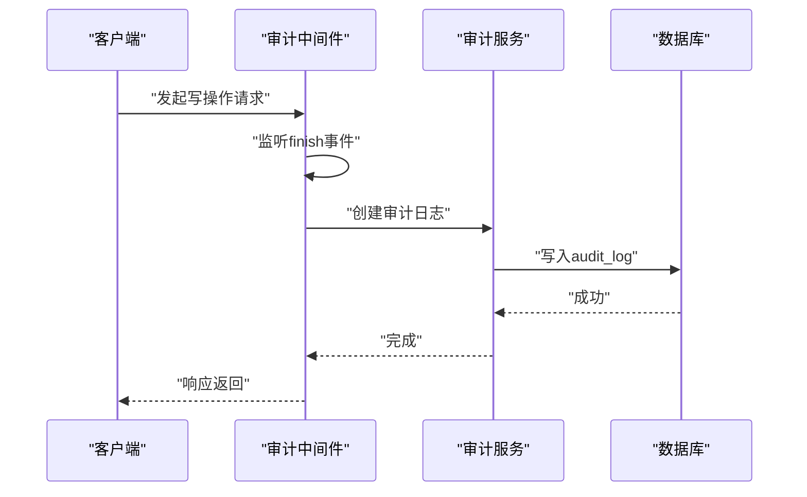
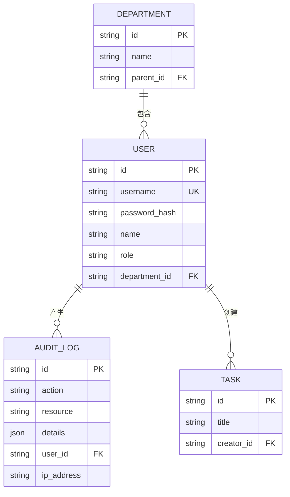
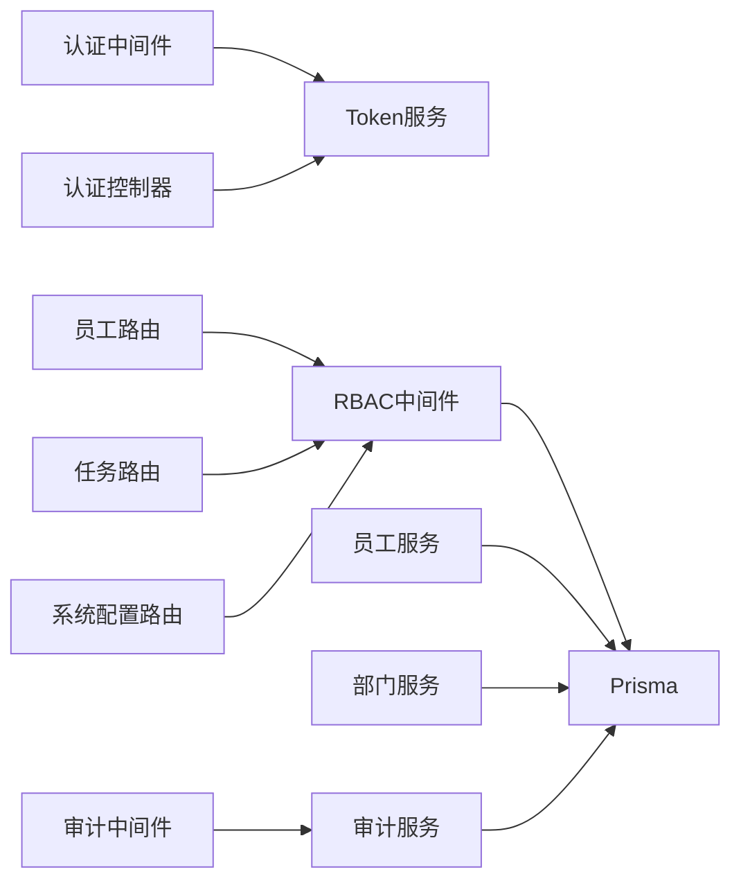

# 权限控制系统

<cite>
**本文引用的文件**
- [rbac.middleware.ts](file://backend/src/middlewares/rbac.middleware.ts)
- [auth.middleware.ts](file://backend/src/middlewares/auth.middleware.ts)
- [auth.controller.ts](file://backend/src/controllers/auth.controller.ts)
- [token.service.ts](file://backend/src/services/token.service.ts)
- [audit.middleware.ts](file://backend/src/middlewares/audit.middleware.ts)
- [audit.controller.ts](file://backend/src/controllers/audit.controller.ts)
- [audit.service.ts](file://backend/src/services/audit.service.ts)
- [employee.service.ts](file://backend/src/services/employee.service.ts)
- [department.service.ts](file://backend/src/services/department.service.ts)
- [employee.routes.ts](file://backend/src/routes/employee.routes.ts)
- [task.routes.ts](file://backend/src/routes/task.routes.ts)
- [systemConfig.routes.ts](file://backend/src/routes/systemConfig.routes.ts)
- [schema.prisma](file://backend/prisma/schema.prisma)
</cite>

## 目录
1. [引言](#引言)
2. [项目结构](#项目结构)
3. [核心组件](#核心组件)
4. [架构总览](#架构总览)
5. [详细组件分析](#详细组件分析)
6. [依赖关系分析](#依赖关系分析)
7. [性能考量](#性能考量)
8. [故障排查指南](#故障排查指南)
9. [结论](#结论)
10. [附录](#附录)

## 引言
本文件为“文件智能审查系统”的权限控制架构文档，聚焦于基于角色的访问控制（RBAC）模型设计与实现，覆盖角色定义、权限分配、角色继承与数据隔离策略；详述JWT令牌验证、中间件权限检查与动态权限计算；阐述审计日志体系与合规性审计；给出装饰器模式与权限注解的应用建议、异常处理策略；并总结权限管理最佳实践与扩展性设计。

## 项目结构
后端采用Express + Prisma + PostgreSQL，权限控制相关代码主要分布在以下层次：
- 中间件层：认证中间件负责JWT解码与黑名单校验；RBAC中间件负责角色校验与数据过滤；审计中间件负责请求完成后的审计日志记录。
- 控制器层：登录/登出/改密等认证控制器，以及各业务控制器（如任务、员工、系统配置）。
- 服务层：TokenService负责JWT签发与校验、Redis黑名单；AuditService负责审计日志的查询与导出；EmployeeService/DepartmentService负责组织与人员相关数据访问。
- 数据模型：Prisma Schema定义了用户、部门、审计日志等实体及关系。

图表来源
- [auth.middleware.ts:1-42](file://backend/src/middlewares/auth.middleware.ts#L1-L42)
- [rbac.middleware.ts:1-101](file://backend/src/middlewares/rbac.middleware.ts#L1-L101)
- [audit.middleware.ts:1-51](file://backend/src/middlewares/audit.middleware.ts#L1-L51)
- [auth.controller.ts:1-126](file://backend/src/controllers/auth.controller.ts#L1-L126)
- [employee.routes.ts:1-29](file://backend/src/routes/employee.routes.ts#L1-L29)
- [task.routes.ts:1-108](file://backend/src/routes/task.routes.ts#L1-L108)
- [systemConfig.routes.ts:1-29](file://backend/src/routes/systemConfig.routes.ts#L1-L29)
- [token.service.ts:1-47](file://backend/src/services/token.service.ts#L1-L47)
- [audit.service.ts:1-152](file://backend/src/services/audit.service.ts#L1-L152)
- [employee.service.ts:1-333](file://backend/src/services/employee.service.ts#L1-L333)
- [department.service.ts:1-113](file://backend/src/services/department.service.ts#L1-L113)
- [schema.prisma:1-343](file://backend/prisma/schema.prisma#L1-L343)

章节来源
- [auth.middleware.ts:1-42](file://backend/src/middlewares/auth.middleware.ts#L1-L42)
- [rbac.middleware.ts:1-101](file://backend/src/middlewares/rbac.middleware.ts#L1-L101)
- [audit.middleware.ts:1-51](file://backend/src/middlewares/audit.middleware.ts#L1-L51)
- [auth.controller.ts:1-126](file://backend/src/controllers/auth.controller.ts#L1-L126)
- [employee.routes.ts:1-29](file://backend/src/routes/employee.routes.ts#L1-L29)
- [task.routes.ts:1-108](file://backend/src/routes/task.routes.ts#L1-L108)
- [systemConfig.routes.ts:1-29](file://backend/src/routes/systemConfig.routes.ts#L1-L29)
- [token.service.ts:1-47](file://backend/src/services/token.service.ts#L1-L47)
- [audit.service.ts:1-152](file://backend/src/services/audit.service.ts#L1-L152)
- [employee.service.ts:1-333](file://backend/src/services/employee.service.ts#L1-L333)
- [department.service.ts:1-113](file://backend/src/services/department.service.ts#L1-L113)
- [schema.prisma:1-343](file://backend/prisma/schema.prisma#L1-L343)

## 核心组件
- 认证中间件：从Authorization头解析Bearer Token，校验Redis黑名单，解码并注入用户信息到请求上下文。
- RBAC中间件：提供requireRole装饰器与基于角色的数据过滤函数，实现“全局/部门/个人”三层数据可见性。
- Token服务：封装JWT签发、校验与黑名单写入/查询。
- 审计中间件与服务：拦截写操作（POST/PUT/PATCH/DELETE），构造审计日志并入库，支持查询与CSV导出。
- 员工与部门服务：提供员工分页、批量导入、更新、删除等能力，并在查询时复用RBAC数据过滤逻辑。
- 路由层：在关键路由上挂载认证与RBAC中间件，形成“注解式”的权限控制。

章节来源
- [auth.middleware.ts:1-42](file://backend/src/middlewares/auth.middleware.ts#L1-L42)
- [rbac.middleware.ts:1-101](file://backend/src/middlewares/rbac.middleware.ts#L1-L101)
- [token.service.ts:1-47](file://backend/src/services/token.service.ts#L1-L47)
- [audit.middleware.ts:1-51](file://backend/src/middlewares/audit.middleware.ts#L1-L51)
- [audit.service.ts:1-152](file://backend/src/services/audit.service.ts#L1-L152)
- [employee.service.ts:1-333](file://backend/src/services/employee.service.ts#L1-L333)
- [department.service.ts:1-113](file://backend/src/services/department.service.ts#L1-L113)
- [employee.routes.ts:1-29](file://backend/src/routes/employee.routes.ts#L1-L29)
- [task.routes.ts:1-108](file://backend/src/routes/task.routes.ts#L1-L108)
- [systemConfig.routes.ts:1-29](file://backend/src/routes/systemConfig.routes.ts#L1-L29)

## 架构总览
下图展示了从请求进入系统到权限校验、数据过滤与审计记录的完整链路。

图表来源
- [auth.middleware.ts:1-42](file://backend/src/middlewares/auth.middleware.ts#L1-L42)
- [rbac.middleware.ts:1-101](file://backend/src/middlewares/rbac.middleware.ts#L1-L101)
- [audit.middleware.ts:1-51](file://backend/src/middlewares/audit.middleware.ts#L1-L51)
- [audit.service.ts:1-152](file://backend/src/services/audit.service.ts#L1-L152)
- [token.service.ts:1-47](file://backend/src/services/token.service.ts#L1-L47)

## 详细组件分析

### RBAC权限模型与角色设计
- 角色层级：ADMIN > MANAGER > USER，体现“越权最小化”原则。
- 角色职责：
  - ADMIN：全局数据可见与操作，系统配置与模式能力配置等敏感操作。
  - MANAGER：仅可见本部门及其子部门的员工与任务数据。
  - USER：仅可见自身创建的数据与个人信息。
- 角色继承：当前实现为显式角色枚举与静态优先级，未引入“角色继承树”，而是通过“角色+部门树”组合实现数据隔离。

图表来源
- [rbac.middleware.ts:1-101](file://backend/src/middlewares/rbac.middleware.ts#L1-L101)
- [schema.prisma:40-44](file://backend/prisma/schema.prisma#L40-L44)

章节来源
- [rbac.middleware.ts:5-26](file://backend/src/middlewares/rbac.middleware.ts#L5-L26)
- [schema.prisma:40-44](file://backend/prisma/schema.prisma#L40-L44)

### 权限矩阵与数据隔离规则
- 任务查询隔离：
  - ADMIN：无限制。
  - MANAGER：仅可见本部门及子部门创建的任务。
  - USER：仅可见本人创建的任务。
- 员工访问隔离：
  - ADMIN：可访问全量员工。
  - MANAGER：仅可见本部门及子部门员工。
  - USER：仅可访问自身。
- 部门树遍历：通过递归查询子部门ID集合，实现跨层级的数据可见性。

图表来源
- [rbac.middleware.ts:34-55](file://backend/src/middlewares/rbac.middleware.ts#L34-L55)

章节来源
- [rbac.middleware.ts:28-55](file://backend/src/middlewares/rbac.middleware.ts#L28-L55)
- [employee.service.ts:28-89](file://backend/src/services/employee.service.ts#L28-L89)

### JWT令牌验证与中间件权限检查
- 认证流程：
  - 从Authorization头提取Bearer Token。
  - 检查Redis黑名单，若命中则拒绝。
  - 使用JWT Secret解码，将用户信息注入到请求对象。
- 登出流程：
  - 将Token写入Redis黑名单，设置过期时间为Token最大生命周期。
- 中间件权限：
  - requireRole装饰器：在路由层以注解形式声明所需角色。
  - 对未认证与权限不足分别返回401/403。

图表来源
- [auth.middleware.ts:8-41](file://backend/src/middlewares/auth.middleware.ts#L8-L41)
- [token.service.ts:11-45](file://backend/src/services/token.service.ts#L11-L45)
- [rbac.middleware.ts:12-26](file://backend/src/middlewares/rbac.middleware.ts#L12-L26)
- [auth.controller.ts:8-57](file://backend/src/controllers/auth.controller.ts#L8-L57)

章节来源
- [auth.middleware.ts:1-42](file://backend/src/middlewares/auth.middleware.ts#L1-L42)
- [token.service.ts:1-47](file://backend/src/services/token.service.ts#L1-L47)
- [rbac.middleware.ts:1-26](file://backend/src/middlewares/rbac.middleware.ts#L1-L26)
- [auth.controller.ts:1-126](file://backend/src/controllers/auth.controller.ts#L1-L126)

### 动态权限计算与装饰器模式
- 路由级装饰器：在路由定义处使用requireRole('ADMIN')等注解，实现“声明式权限”。
- 控制器内动态过滤：在业务控制器中调用getTaskFilterByRole构建查询条件，实现运行时权限计算。
- 建议：
  - 将“角色-资源-动作”映射抽象为策略对象，结合装饰器与策略工厂，提升可维护性。
  - 对复杂权限表达式（如“拥有某资源的读权限且不在黑名单”）可封装为权限守卫函数。

章节来源
- [employee.routes.ts:17-26](file://backend/src/routes/employee.routes.ts#L17-L26)
- [task.routes.ts:81-84](file://backend/src/routes/task.routes.ts#L81-L84)
- [systemConfig.routes.ts:16-26](file://backend/src/routes/systemConfig.routes.ts#L16-L26)
- [rbac.middleware.ts:34-55](file://backend/src/middlewares/rbac.middleware.ts#L34-L55)

### 审计日志系统
- 自动记录：对写操作（POST/PUT/PATCH/DELETE）在请求完成后记录审计日志，避免记录密码等敏感字段。
- 查询与导出：支持按操作类型、资源、用户、时间范围查询，支持CSV导出。
- 异常处理：捕获数据库外键约束失败等异常，避免影响主流程。

图表来源
- [audit.middleware.ts:7-50](file://backend/src/middlewares/audit.middleware.ts#L7-L50)
- [audit.service.ts:68-78](file://backend/src/services/audit.service.ts#L68-L78)

章节来源
- [audit.middleware.ts:1-51](file://backend/src/middlewares/audit.middleware.ts#L1-L51)
- [audit.controller.ts:1-57](file://backend/src/controllers/audit.controller.ts#L1-L57)
- [audit.service.ts:1-152](file://backend/src/services/audit.service.ts#L1-L152)

### 数据模型与关系
- 用户、部门、审计日志三者构成权限与审计的核心数据模型，其中用户与部门为多对一关系，审计日志可关联用户。
- 任务与用户之间为一对多关系，任务查询时需结合用户角色与部门树进行过滤。

图表来源
- [schema.prisma:10-38](file://backend/prisma/schema.prisma#L10-L38)
- [schema.prisma:188-199](file://backend/prisma/schema.prisma#L188-L199)
- [schema.prisma:90-109](file://backend/prisma/schema.prisma#L90-L109)

章节来源
- [schema.prisma:10-38](file://backend/prisma/schema.prisma#L10-L38)
- [schema.prisma:188-199](file://backend/prisma/schema.prisma#L188-L199)
- [schema.prisma:90-109](file://backend/prisma/schema.prisma#L90-L109)

### 权限控制实现细节
- 装饰器模式应用：在路由层通过requireRole实现“注解式”权限控制，简洁直观。
- 权限注解：在关键路由（如系统配置、任务状态更新、员工批量操作）上标注所需角色。
- 异常处理：认证中间件对未提供Token、格式错误、黑名单命中、Token无效或过期等情况统一返回401；RBAC中间件对角色不满足返回403；控制器对业务异常进行统一包装与日志记录。

章节来源
- [employee.routes.ts:17-26](file://backend/src/routes/employee.routes.ts#L17-L26)
- [task.routes.ts:81-84](file://backend/src/routes/task.routes.ts#L81-L84)
- [systemConfig.routes.ts:16-26](file://backend/src/routes/systemConfig.routes.ts#L16-L26)
- [auth.middleware.ts:8-41](file://backend/src/middlewares/auth.middleware.ts#L8-L41)
- [rbac.middleware.ts:12-26](file://backend/src/middlewares/rbac.middleware.ts#L12-L26)
- [auth.controller.ts:59-73](file://backend/src/controllers/auth.controller.ts#L59-L73)

## 依赖关系分析
- 中间件依赖：
  - 认证中间件依赖Token服务进行JWT校验与黑名单检查。
  - RBAC中间件依赖Prisma查询部门树与用户信息，实现数据过滤。
  - 审计中间件依赖审计服务进行日志落库。
- 控制器依赖：
  - 业务控制器依赖对应服务（员工、任务、系统配置等）。
- 服务依赖：
  - Token服务依赖环境变量与Redis客户端。
  - 审计服务依赖Prisma与用户关联查询。
- 数据模型依赖：
  - 所有服务均依赖Prisma Schema定义的实体与关系。

图表来源
- [auth.middleware.ts:1-42](file://backend/src/middlewares/auth.middleware.ts#L1-L42)
- [rbac.middleware.ts:1-101](file://backend/src/middlewares/rbac.middleware.ts#L1-L101)
- [audit.middleware.ts:1-51](file://backend/src/middlewares/audit.middleware.ts#L1-L51)
- [token.service.ts:1-47](file://backend/src/services/token.service.ts#L1-L47)
- [audit.service.ts:1-152](file://backend/src/services/audit.service.ts#L1-L152)
- [employee.routes.ts:1-29](file://backend/src/routes/employee.routes.ts#L1-L29)
- [task.routes.ts:1-108](file://backend/src/routes/task.routes.ts#L1-L108)
- [systemConfig.routes.ts:1-29](file://backend/src/routes/systemConfig.routes.ts#L1-L29)
- [employee.service.ts:1-333](file://backend/src/services/employee.service.ts#L1-L333)
- [department.service.ts:1-113](file://backend/src/services/department.service.ts#L1-L113)
- [schema.prisma:1-343](file://backend/prisma/schema.prisma#L1-L343)

章节来源
- [auth.middleware.ts:1-42](file://backend/src/middlewares/auth.middleware.ts#L1-L42)
- [rbac.middleware.ts:1-101](file://backend/src/middlewares/rbac.middleware.ts#L1-L101)
- [audit.middleware.ts:1-51](file://backend/src/middlewares/audit.middleware.ts#L1-L51)
- [token.service.ts:1-47](file://backend/src/services/token.service.ts#L1-L47)
- [audit.service.ts:1-152](file://backend/src/services/audit.service.ts#L1-L152)
- [employee.routes.ts:1-29](file://backend/src/routes/employee.routes.ts#L1-L29)
- [task.routes.ts:1-108](file://backend/src/routes/task.routes.ts#L1-L108)
- [systemConfig.routes.ts:1-29](file://backend/src/routes/systemConfig.routes.ts#L1-L29)
- [employee.service.ts:1-333](file://backend/src/services/employee.service.ts#L1-L333)
- [department.service.ts:1-113](file://backend/src/services/department.service.ts#L1-L113)
- [schema.prisma:1-343](file://backend/prisma/schema.prisma#L1-L343)

## 性能考量
- JWT校验与Redis黑名单检查：建议在网关或集中式认证服务中缓存常用用户信息，降低重复校验成本。
- 部门树递归查询：在大型组织中，部门树遍历可能带来查询开销，建议：
  - 对部门树进行缓存（如Redis ZSET或Tree结构）。
  - 在新增/更新部门关系时同步更新缓存。
- 审计日志写入：异步写入或批量写入可减少对主业务的影响；对高频写操作可考虑队列化。

## 故障排查指南
- 401 未认证：
  - 检查Authorization头格式是否为Bearer Token。
  - 确认Token未在Redis黑名单中。
  - 核对JWT Secret与过期时间配置。
- 403 权限不足：
  - 确认用户角色是否满足路由requireRole要求。
  - 检查用户所属部门ID是否正确。
- 审计日志缺失：
  - 确认请求方法为写操作（POST/PUT/PATCH/DELETE）。
  - 检查审计中间件是否正确挂载。
  - 排查数据库外键约束导致的日志写入失败。

章节来源
- [auth.middleware.ts:8-41](file://backend/src/middlewares/auth.middleware.ts#L8-L41)
- [rbac.middleware.ts:12-26](file://backend/src/middlewares/rbac.middleware.ts#L12-L26)
- [audit.middleware.ts:7-50](file://backend/src/middlewares/audit.middleware.ts#L7-L50)
- [audit.service.ts:68-78](file://backend/src/services/audit.service.ts#L68-L78)

## 结论
本权限控制架构以RBAC为核心，结合JWT认证、中间件权限检查与动态数据过滤，实现了ADMIN/MANAGER/USER三层权限与相应的数据隔离。审计中间件提供了自动化的合规性审计能力。整体设计清晰、可扩展性强，适合在企业级文件智能审查系统中落地与演进。

## 附录

### 权限管理最佳实践
- 最小权限原则：仅授予完成工作所需的最低权限。
- 定期权限审查：对高权限账户（ADMIN/MANAGER）进行周期性审查与权限回收。
- 权限变更流程：建立变更申请、审批、生效与回滚流程，确保可追溯。
- 审计留痕：所有敏感操作必须被审计中间件自动记录，保障合规。

### 新角色添加指南
- 在Prisma Schema中扩展Role枚举（如新增GUEST等）。
- 在RBAC中间件中完善数据过滤逻辑，确保新角色具备正确的数据可见性。
- 在路由层通过requireRole注解声明新角色的访问范围。
- 在审计策略中明确新角色的敏感操作范围。

章节来源
- [schema.prisma:40-44](file://backend/prisma/schema.prisma#L40-L44)
- [rbac.middleware.ts:34-55](file://backend/src/middlewares/rbac.middleware.ts#L34-L55)
- [employee.routes.ts:17-26](file://backend/src/routes/employee.routes.ts#L17-L26)
- [task.routes.ts:81-84](file://backend/src/routes/task.routes.ts#L81-L84)
- [systemConfig.routes.ts:16-26](file://backend/src/routes/systemConfig.routes.ts#L16-L26)