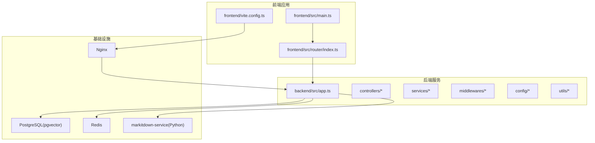
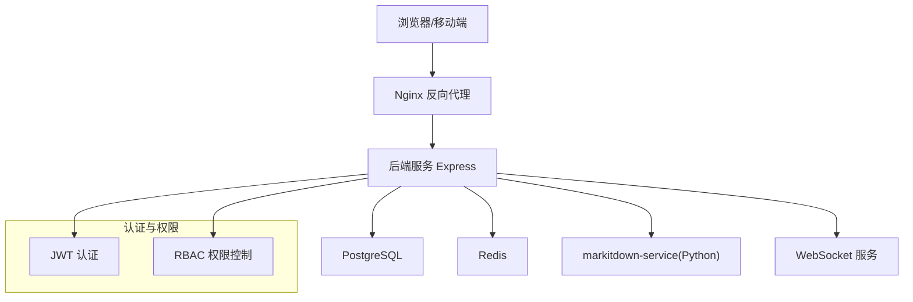
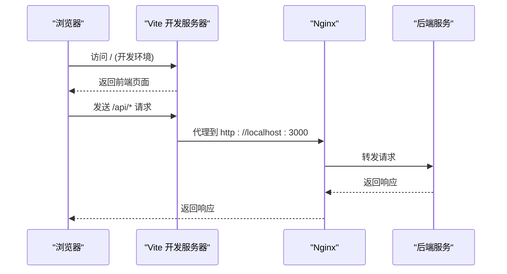
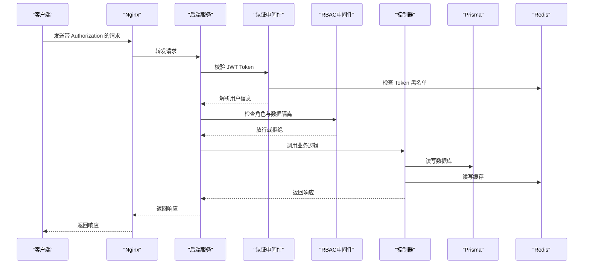
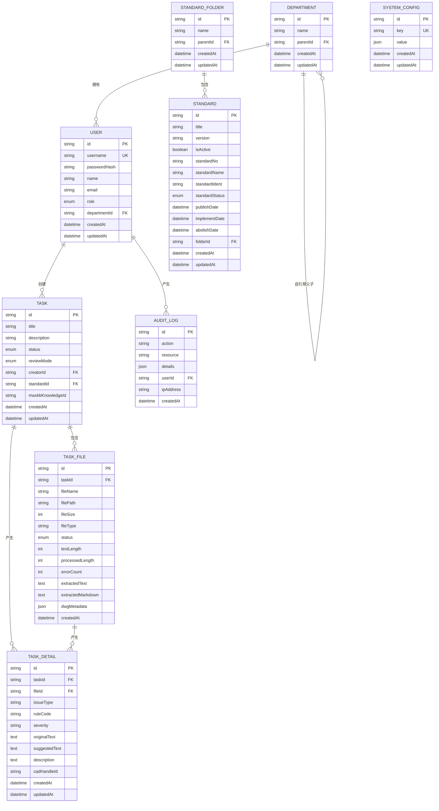
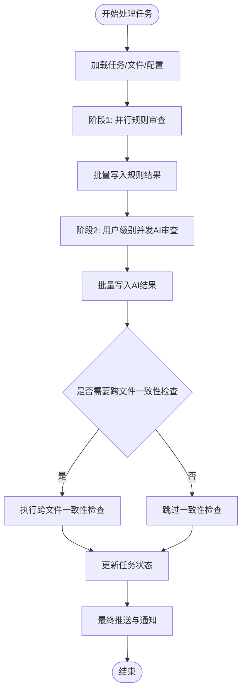
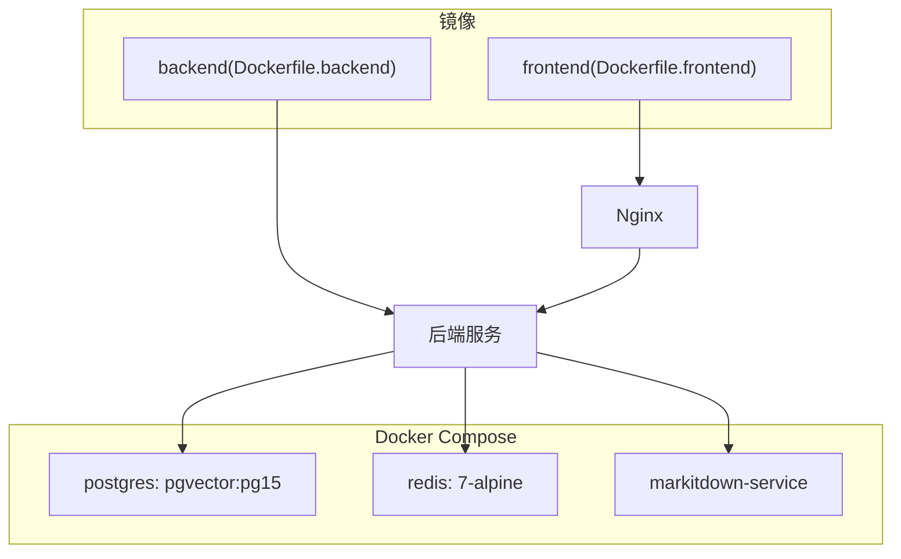
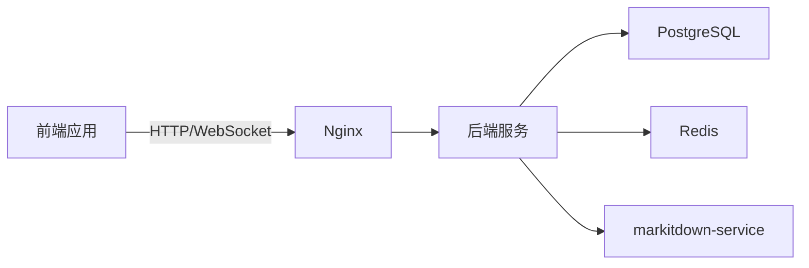

# 系统架构设计

<cite>
**本文档引用的文件**
- [README.md](file://README.md)
- [docker-compose.yml](file://docker-compose.yml)
- [Dockerfile.backend](file://Dockerfile.backend)
- [Dockerfile.frontend](file://Dockerfile.frontend)
- [backend/src/app.ts](file://backend/src/app.ts)
- [backend/prisma/schema.prisma](file://backend/prisma/schema.prisma)
- [backend/src/config/env.ts](file://backend/src/config/env.ts)
- [backend/src/controllers/auth.controller.ts](file://backend/src/controllers/auth.controller.ts)
- [backend/src/middlewares/auth.middleware.ts](file://backend/src/middlewares/auth.middleware.ts)
- [backend/src/utils/redis.ts](file://backend/src/utils/redis.ts)
- [frontend/src/main.ts](file://frontend/src/main.ts)
- [frontend/src/router/index.ts](file://frontend/src/router/index.ts)
- [frontend/vite.config.ts](file://frontend/vite.config.ts)
- [nginx.conf](file://nginx.conf)
- [backend/src/services/review.service.ts](file://backend/src/services/review.service.ts)
</cite>

## 目录
1. [引言](#引言)
2. [项目结构](#项目结构)
3. [核心组件](#核心组件)
4. [架构总览](#架构总览)
5. [详细组件分析](#详细组件分析)
6. [依赖关系分析](#依赖关系分析)
7. [性能考量](#性能考量)
8. [故障排查指南](#故障排查指南)
9. [结论](#结论)
10. [附录](#附录)

## 引言
本系统为一个企业级文件合规性检查平台，提供前后端分离架构、微服务理念下的模块化后端、容器化部署策略，并围绕文件智能审查的核心业务，集成规则引擎、多模态解析、RAG检索增强与LLM深度审查能力。系统采用Vue 3 + TypeScript作为前端技术栈，Express.js + TypeScript作为后端技术栈，PostgreSQL作为关系型数据库，Redis作为缓存与会话存储，配合Nginx进行反向代理与静态资源服务。

## 项目结构
系统采用“前端应用 + 后端服务 + 基础设施”三层结构，配合Docker容器编排实现离线友好与可移植部署。

**图表来源**
- [frontend/src/main.ts:1-30](file://frontend/src/main.ts#L1-L30)
- [frontend/src/router/index.ts:1-116](file://frontend/src/router/index.ts#L1-L116)
- [frontend/vite.config.ts:1-78](file://frontend/vite.config.ts#L1-L78)
- [backend/src/app.ts:1-67](file://backend/src/app.ts#L1-L67)
- [docker-compose.yml:1-64](file://docker-compose.yml#L1-L64)

**章节来源**
- [README.md:155-221](file://README.md#L155-L221)
- [docker-compose.yml:1-64](file://docker-compose.yml#L1-L64)

## 核心组件
- 前端应用：基于Vue 3 + TypeScript，使用Vite构建，Element Plus提供UI组件，Pinia进行状态管理，Vue Router进行路由控制，Axios封装HTTP请求。
- 后端服务：基于Express.js + TypeScript，采用模块化控制器、中间件与服务层，Prisma作为ORM，ioredis提供Redis客户端，JWT进行身份认证，Multer处理文件上传，ExcelJS支持Excel导入导出。
- 基础设施：PostgreSQL提供关系型数据存储，Redis提供缓存与会话存储，Nginx提供反向代理、静态资源服务与健康检查，markitdown-service提供Python解析服务。
- 审查流水线：两阶段并发编排，规则审查阶段快速并行，AI审查阶段按用户并发配额执行，支持跨文件一致性检查与增量推送。

**章节来源**
- [README.md:54-85](file://README.md#L54-L85)
- [backend/src/app.ts:1-67](file://backend/src/app.ts#L1-L67)
- [backend/prisma/schema.prisma:1-343](file://backend/prisma/schema.prisma#L1-L343)
- [backend/src/utils/redis.ts:1-51](file://backend/src/utils/redis.ts#L1-L51)

## 架构总览
系统采用前后端分离与微服务理念相结合的架构。前端通过Nginx代理访问后端API，后端通过Prisma访问PostgreSQL，通过Redis进行缓存与会话管理，通过Python解析服务处理复杂文件解析任务，通过WebSocket实现实时进度推送。

**图表来源**
- [nginx.conf:1-82](file://nginx.conf#L1-L82)
- [backend/src/app.ts:1-67](file://backend/src/app.ts#L1-L67)
- [backend/src/middlewares/auth.middleware.ts:1-42](file://backend/src/middlewares/auth.middleware.ts#L1-L42)
- [backend/src/controllers/auth.controller.ts:1-126](file://backend/src/controllers/auth.controller.ts#L1-L126)

## 详细组件分析

### 前端应用
- 应用入口：初始化Vue应用、Pinia状态管理、路由系统，并在路由切换时进行请求取消与WebSocket连接管理。
- 路由系统：基于Vue Router实现页面导航，支持鉴权守卫与管理员页面访问控制。
- 构建与代理：Vite配置支持ES2020目标、手动分包策略、API代理与WebSocket代理，开发环境提供热更新与类型检查跳过。

**图表来源**
- [frontend/src/main.ts:1-30](file://frontend/src/main.ts#L1-L30)
- [frontend/src/router/index.ts:1-116](file://frontend/src/router/index.ts#L1-L116)
- [frontend/vite.config.ts:57-77](file://frontend/vite.config.ts#L57-L77)
- [nginx.conf:22-45](file://nginx.conf#L22-L45)

**章节来源**
- [frontend/src/main.ts:1-30](file://frontend/src/main.ts#L1-L30)
- [frontend/src/router/index.ts:1-116](file://frontend/src/router/index.ts#L1-L116)
- [frontend/vite.config.ts:1-78](file://frontend/vite.config.ts#L1-L78)

### 后端服务
- 应用入口：注册全局中间件（CORS、日志、审计日志）、静态文件服务、路由注册与健康检查端点。
- 认证与权限：JWT认证中间件验证Token有效性并加入黑名单检查，RBAC中间件根据角色与部门数据隔离控制访问。
- 数据访问：Prisma ORM负责数据库Schema与查询，环境变量集中管理数据库与Redis连接。
- 缓存：Redis客户端封装常用操作，支持键值存储与TTL设置。

**图表来源**
- [backend/src/app.ts:1-67](file://backend/src/app.ts#L1-L67)
- [backend/src/middlewares/auth.middleware.ts:1-42](file://backend/src/middlewares/auth.middleware.ts#L1-L42)
- [backend/src/controllers/auth.controller.ts:1-126](file://backend/src/controllers/auth.controller.ts#L1-L126)
- [backend/src/config/env.ts:1-14](file://backend/src/config/env.ts#L1-L14)
- [backend/src/utils/redis.ts:1-51](file://backend/src/utils/redis.ts#L1-L51)

**章节来源**
- [backend/src/app.ts:1-67](file://backend/src/app.ts#L1-L67)
- [backend/src/middlewares/auth.middleware.ts:1-42](file://backend/src/middlewares/auth.middleware.ts#L1-L42)
- [backend/src/controllers/auth.controller.ts:1-126](file://backend/src/controllers/auth.controller.ts#L1-L126)
- [backend/src/config/env.ts:1-14](file://backend/src/config/env.ts#L1-L14)
- [backend/src/utils/redis.ts:1-51](file://backend/src/utils/redis.ts#L1-L51)

### 数据模型与关系
系统采用Prisma定义核心数据模型，涵盖部门、用户、标准库、任务、任务文件、任务详情、审计日志与系统配置等，支持树形部门层级、用户与部门关联、任务与文件/详情的关联关系。

**图表来源**
- [backend/prisma/schema.prisma:10-343](file://backend/prisma/schema.prisma#L10-L343)

**章节来源**
- [backend/prisma/schema.prisma:1-343](file://backend/prisma/schema.prisma#L1-L343)

### 审查流水线与并发控制
系统采用两阶段并发编排：阶段1规则审查快速并行，阶段2AI审查按用户并发配额执行，支持跨文件一致性检查与增量推送。用户级别并发控制确保多用户公平分配资源。

**图表来源**
- [backend/src/services/review.service.ts:1-800](file://backend/src/services/review.service.ts#L1-L800)

**章节来源**
- [backend/src/services/review.service.ts:1-800](file://backend/src/services/review.service.ts#L1-L800)

### 容器化与部署
- Docker Compose编排：PostgreSQL、Redis、markitdown-service容器，支持健康检查与资源限制。
- 前端镜像：基于Nginx Alpine，复制构建产物与Nginx配置，暴露80端口并提供健康检查。
- 后端镜像：多阶段构建，先在Docker中生成Prisma Client，再复制至运行时镜像，设置健康检查与入口脚本。

**图表来源**
- [docker-compose.yml:1-64](file://docker-compose.yml#L1-L64)
- [Dockerfile.frontend:1-27](file://Dockerfile.frontend#L1-L27)
- [Dockerfile.backend:1-85](file://Dockerfile.backend#L1-L85)

**章节来源**
- [docker-compose.yml:1-64](file://docker-compose.yml#L1-L64)
- [Dockerfile.frontend:1-27](file://Dockerfile.frontend#L1-L27)
- [Dockerfile.backend:1-85](file://Dockerfile.backend#L1-L85)

## 依赖关系分析
- 前端依赖：Vue 3、Element Plus、Pinia、Vue Router、Axios、ECharts等，构建时通过Vite进行代码分割与代理配置。
- 后端依赖：Express、Prisma、jsonwebtoken、ioredis、bcryptjs、multer、exceljs等，通过NPM管理。
- 基础设施依赖：PostgreSQL提供关系型数据存储，Redis提供缓存与会话存储，Nginx提供反向代理与静态资源服务。

**图表来源**
- [frontend/vite.config.ts:1-78](file://frontend/vite.config.ts#L1-L78)
- [backend/src/app.ts:1-67](file://backend/src/app.ts#L1-L67)
- [docker-compose.yml:1-64](file://docker-compose.yml#L1-L64)

**章节来源**
- [frontend/vite.config.ts:1-78](file://frontend/vite.config.ts#L1-L78)
- [backend/src/app.ts:1-67](file://backend/src/app.ts#L1-L67)
- [backend/package.json:1-64](file://backend/package.json#L1-L64)

## 性能考量
- 前端性能：Vite构建目标为ES2020，手动分包策略将Vue生态、Element Plus、ECharts等拆分为独立chunk，提升缓存命中率与并行加载效率。
- 后端性能：审查流水线采用两阶段并发，规则审查阶段快速并行，AI审查阶段按用户并发配额执行，避免资源争用；Redis缓存减少数据库压力；Nginx启用Gzip压缩与静态资源缓存。
- 数据库性能：Prisma提供类型安全的查询与迁移管理，PostgreSQL支持向量扩展以支撑RAG检索；合理索引与查询优化有助于提升查询性能。
- 缓存策略：Redis用于Token黑名单、会话状态与临时数据缓存，设置合理的TTL与键空间淘汰策略。

**章节来源**
- [frontend/vite.config.ts:35-51](file://frontend/vite.config.ts#L35-L51)
- [nginx.conf:10-16](file://nginx.conf#L10-L16)
- [backend/src/utils/redis.ts:1-51](file://backend/src/utils/redis.ts#L1-L51)

## 故障排查指南
- 健康检查：后端提供/health端点，Nginx提供/health端点，PostgreSQL与Redis均配置健康检查，Compose文件中定义了健康检查策略。
- 日志与审计：后端使用Morgan记录请求日志，全局审计中间件记录POST/PUT/DELETE操作，便于问题定位与安全审计。
- 认证问题：检查Authorization头格式、JWT签名密钥与过期时间、Redis中的Token黑名单状态。
- 数据库与缓存：确认DATABASE_URL与REDIS_URL配置正确，Prisma迁移与种子数据执行情况，Redis连接状态与键空间。

**章节来源**
- [backend/src/app.ts:59-61](file://backend/src/app.ts#L59-L61)
- [nginx.conf:71-75](file://nginx.conf#L71-L75)
- [backend/src/middlewares/auth.middleware.ts:1-42](file://backend/src/middlewares/auth.middleware.ts#L1-L42)
- [backend/src/config/env.ts:1-14](file://backend/src/config/env.ts#L1-L14)

## 结论
本系统通过前后端分离与微服务理念，结合容器化部署策略，实现了高可用、可扩展的企业级文件智能审查平台。前端采用现代化技术栈提供良好的用户体验，后端通过模块化设计与并发控制保证高性能与稳定性，数据库与缓存的合理选型满足业务需求。通过Nginx统一入口与健康检查机制，系统具备良好的可观测性与运维友好性。

## 附录
- 技术栈选型说明
  - 前端：Vue 3 + TypeScript + Vite + Element Plus + Pinia + Vue Router + Axios，提供现代化开发体验与良好性能。
  - 后端：Express.js + TypeScript + Prisma + JWT + ioredis + bcryptjs + multer + exceljs，提供类型安全与模块化架构。
  - 基础设施：PostgreSQL + Redis + Docker & Docker Compose，提供可靠的数据存储与容器化部署能力。
- API接口与权限矩阵详见项目README中的接口一览与RBAC权限模型章节。

**章节来源**
- [README.md:225-298](file://README.md#L225-L298)
- [README.md:299-304](file://README.md#L299-L304)