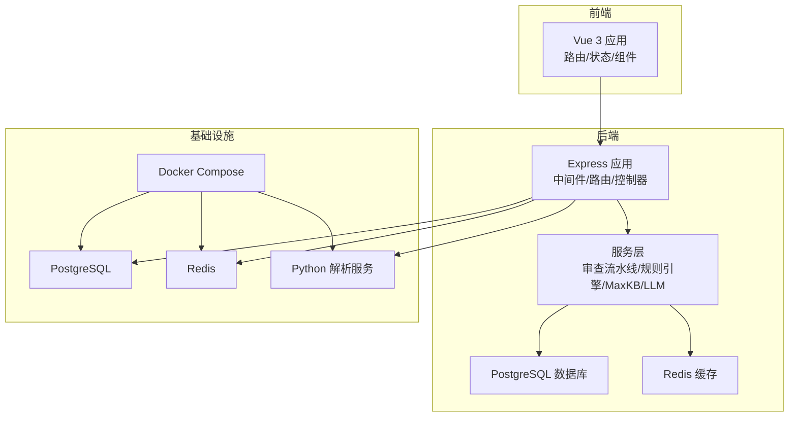
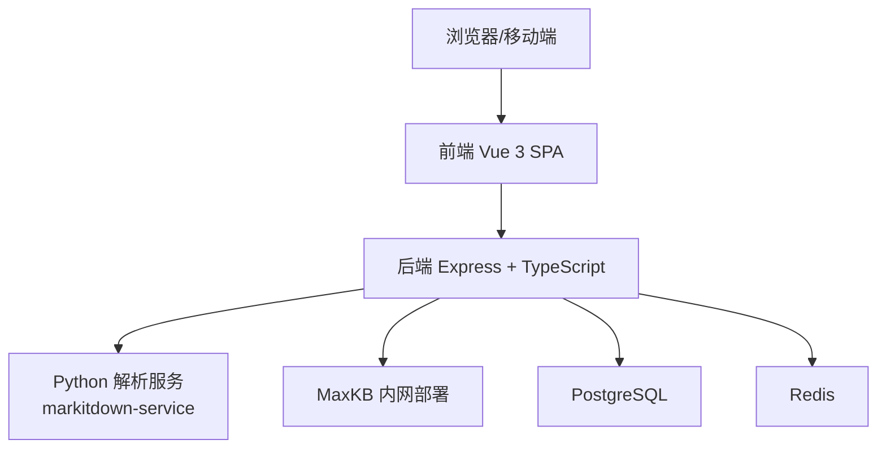
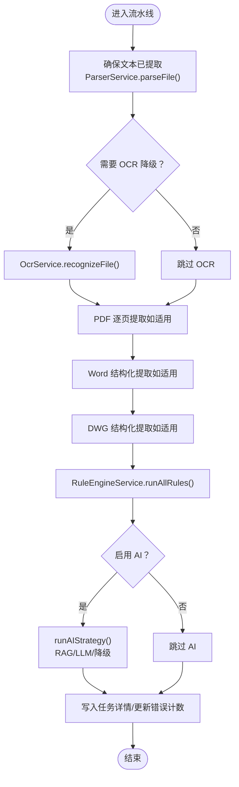
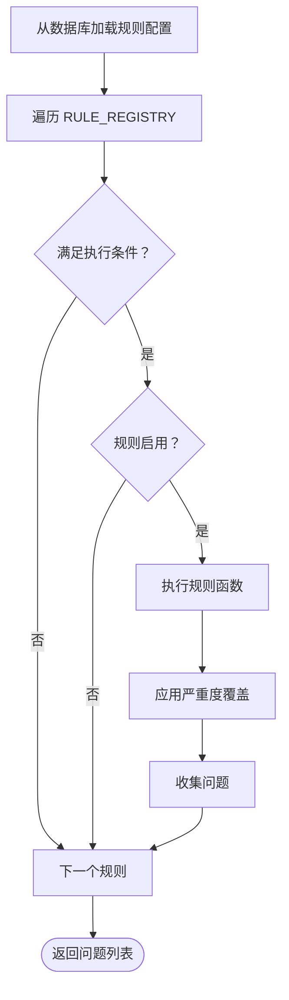
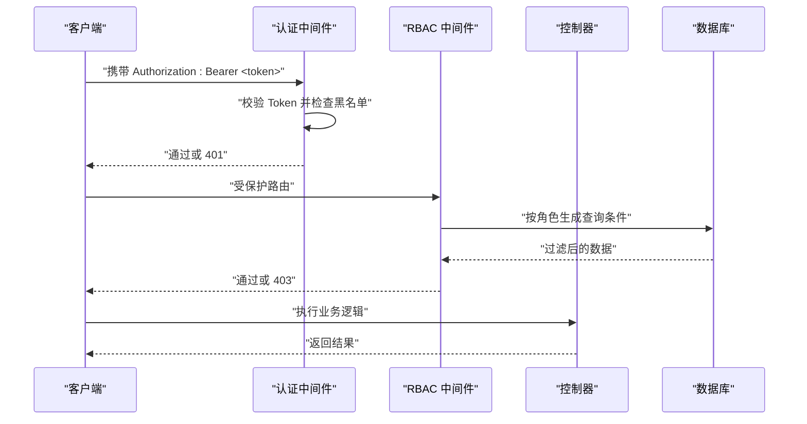
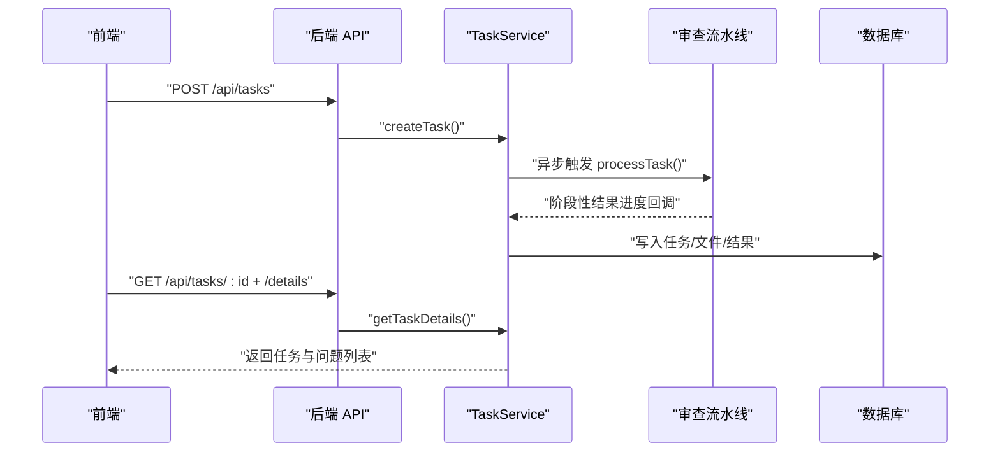
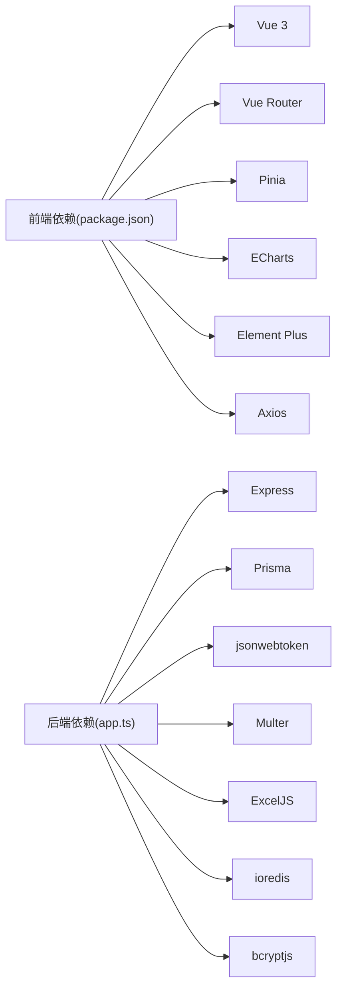

# 项目概述

<cite>
**本文引用的文件**
- [README.md](file://README.md)
- [系统架构设计与功能规格.md](file://docs/系统架构设计与功能规格.md)
- [文件智能审查系统_架构设计文档.md](file://docs/文件智能审查系统_架构设计文档.md)
- [app.ts](file://backend/src/app.ts)
- [main.ts](file://frontend/src/main.ts)
- [base-pipeline.ts](file://backend/src/services/review-pipeline/base-pipeline.ts)
- [rules/index.ts](file://backend/src/services/rules/index.ts)
- [schema.prisma](file://backend/prisma/schema.prisma)
- [docker-compose.yml](file://docker-compose.yml)
- [auth.middleware.ts](file://backend/src/middlewares/auth.middleware.ts)
- [rbac.middleware.ts](file://backend/src/middlewares/rbac.middleware.ts)
- [task.controller.ts](file://backend/src/controllers/task.controller.ts)
- [index.ts](file://frontend/src/router/index.ts)
- [package.json](file://frontend/package.json)
</cite>

## 目录
1. [简介](#简介)
2. [项目结构](#项目结构)
3. [核心组件](#核心组件)
4. [架构总览](#架构总览)
5. [详细组件分析](#详细组件分析)
6. [依赖分析](#依赖分析)
7. [性能考虑](#性能考虑)
8. [故障排查指南](#故障排查指南)
9. [结论](#结论)
10. [附录](#附录)

## 简介
文件智能审查系统是一个面向企业级的工程文档合规性检查平台，支持多格式文件（DWG、Word、Excel、PDF 等）的自动审查与报告生成。系统通过“确定性规则引擎 + AI 审查（MaxKB RAG + LLM）”的双轨机制，为企业提供高覆盖率、可解释、可追溯的合规检查能力，并配套数据看板、部门与账号管理、安全审计日志等功能，帮助组织建立标准化的文档质量治理体系。

系统定位为内网私有化部署的 Web 应用，强调：
- 多格式文件解析与结构化提取
- 确定性规则与 AI 审查相结合
- RBAC 权限与数据隔离
- 审查流水线可配置与可扩展
- 容器化部署与可观测性

## 项目结构
项目采用前后端分离架构，后端基于 Node.js/Express + TypeScript，前端基于 Vue 3 + Vite，数据库使用 PostgreSQL，缓存使用 Redis，AI 引擎采用 MaxKB 内网部署。

图表来源
- [app.ts:28-67](file://backend/src/app.ts#L28-L67)
- [docker-compose.yml:3-64](file://docker-compose.yml#L3-L64)

章节来源
- [README.md:155-221](file://README.md#L155-L221)
- [系统架构设计与功能规格.md:33-88](file://docs/系统架构设计与功能规格.md#L33-L88)

## 核心组件
- 审查流水线（Review Pipeline）
  - 以能力驱动的流水线基类，统一编排“阶段1（规则+标准引用）+阶段2（AI 审查）”，支持多种模式（库审文、以文审文、一致性、错别字/语法、多模态、自定义规则、全量审查）。
  - 支持 OCR 降级、PDF 逐页提取、DWG 结构化模拟、Word 结构化模拟等适配。
- 规则引擎（Rule Engine）
  - 提供 10 大类、30+ 条确定性规则，覆盖命名、编码、封面属性、页眉页码、格式、完整性、一致性、排版布局、正文编码等。
  - 规则配置存储于数据库，支持启用/禁用、严重度覆盖、高级配置（正则、阈值）。
- MaxKB 集成与 RAG
  - 通过 MaxKB 管理知识库与应用，支持 RAG 检索 + LLM 审查，提供“自建 RAG + 自有 LLM”的混合方案。
- RBAC 权限与数据隔离
  - 基于角色（ADMIN/MANAGER/USER）与部门树的权限控制，支持按角色过滤任务查询。
- 中间件与安全
  - JWT 认证、登出加入黑名单、全局审计日志、错误处理。
- 前后端路由与状态
  - 前端使用 Vue Router + Pinia，后端路由集中注册，统一响应格式。

章节来源
- [base-pipeline.ts:37-200](file://backend/src/services/review-pipeline/base-pipeline.ts#L37-L200)
- [rules/index.ts:48-157](file://backend/src/services/rules/index.ts#L48-L157)
- [schema.prisma:10-224](file://backend/prisma/schema.prisma#L10-L224)
- [auth.middleware.ts:8-41](file://backend/src/middlewares/auth.middleware.ts#L8-L41)
- [rbac.middleware.ts:12-55](file://backend/src/middlewares/rbac.middleware.ts#L12-L55)
- [app.ts:28-67](file://backend/src/app.ts#L28-L67)
- [index.ts:7-88](file://frontend/src/router/index.ts#L7-L88)

## 架构总览
系统采用“前端 SPA + 后端 API + 外部解析服务 + 数据库/缓存”的分层架构。审查流水线在后端编排，解析服务负责多格式文件结构化提取，MaxKB 提供知识库检索与 LLM 能力，数据库持久化任务、结果与配置，Redis 提供缓存与令牌黑名单。

图表来源
- [系统架构设计与功能规格.md:33-88](file://docs/系统架构设计与功能规格.md#L33-L88)
- [docker-compose.yml:38-60](file://docker-compose.yml#L38-L60)

## 详细组件分析

### 审查流水线（Review Pipeline）
- 能力驱动：通过 ModeCapabilities 配置决定是否启用规则、AI、标准引用等能力。
- 阶段划分：
  - 阶段1：文本提取 → 钩子（beforeFastPhase）→ 规则+标准引用并行 → 钩子（afterFastPhase）
  - 阶段2：AI 审查策略（runAIStrategy）→ RAG/LLM/降级
- 关键能力：
  - OCR 降级：针对 PDF 扫描件或无文本场景
  - PDF 逐页提取：支持页眉/页码规则
  - DWG/Word 结构化模拟：为规则引擎提供结构化上下文
  - 标准引用检查：提取 → 比对 → 状态校验 → 字符级差异定位
- AI 引擎策略：
  - auto/rag/rag_llm/llm_only/disabled
  - 自建 RAG 优先，失败时降级到 LLM + 知识库段落

图表来源
- [base-pipeline.ts:141-200](file://backend/src/services/review-pipeline/base-pipeline.ts#L141-L200)
- [base-pipeline.ts:283-303](file://backend/src/services/review-pipeline/base-pipeline.ts#L283-L303)
- [base-pipeline.ts:462-509](file://backend/src/services/review-pipeline/base-pipeline.ts#L462-L509)

章节来源
- [base-pipeline.ts:37-200](file://backend/src/services/review-pipeline/base-pipeline.ts#L37-L200)
- [base-pipeline.ts:283-303](file://backend/src/services/review-pipeline/base-pipeline.ts#L283-L303)
- [base-pipeline.ts:462-509](file://backend/src/services/review-pipeline/base-pipeline.ts#L462-L509)

### 规则引擎（Rule Engine）
- 规则注册与执行：
  - RULE_REGISTRY 维护规则前缀、分类、执行函数与执行条件
  - runAllRules 从数据库加载规则配置（启用/严重度/高级配置），按条件过滤并执行
- 规则覆盖：
  - 支持按规则代码或前缀覆盖严重度
- 文件类型适配：
  - 针对 PDF 的页眉/页码、DWG 的图层/标注/标准引用等规则条件判断

图表来源
- [rules/index.ts:163-198](file://backend/src/services/rules/index.ts#L163-L198)
- [rules/index.ts:222-266](file://backend/src/services/rules/index.ts#L222-L266)

章节来源
- [rules/index.ts:48-157](file://backend/src/services/rules/index.ts#L48-L157)
- [rules/index.ts:163-198](file://backend/src/services/rules/index.ts#L163-L198)
- [rules/index.ts:222-266](file://backend/src/services/rules/index.ts#L222-L266)

### RBAC 权限与数据隔离
- 角色权限矩阵：
  - ADMIN：全局可见/可操作
  - MANAGER：本部门及子部门数据
  - USER：仅自己创建的数据
- 数据过滤：
  - getTaskFilterByRole 根据角色动态生成 Prisma 查询条件
  - canAccessUser 支持跨页面资源访问校验
- 认证流程：
  - JWT 令牌签发与校验，登出加入黑名单，统一 401/403 响应

图表来源
- [auth.middleware.ts:8-41](file://backend/src/middlewares/auth.middleware.ts#L8-L41)
- [rbac.middleware.ts:34-55](file://backend/src/middlewares/rbac.middleware.ts#L34-L55)
- [task.controller.ts:76-109](file://backend/src/controllers/task.controller.ts#L76-L109)

章节来源
- [rbac.middleware.ts:12-55](file://backend/src/middlewares/rbac.middleware.ts#L12-L55)
- [auth.middleware.ts:8-41](file://backend/src/middlewares/auth.middleware.ts#L8-L41)
- [task.controller.ts:76-109](file://backend/src/controllers/task.controller.ts#L76-L109)

### 审查任务管理（Task）
- 创建任务：支持多文件上传、标准选择、审查模式、MaxKB 知识库选择
- 列表与详情：支持分页、筛选、Mine 选项、进度轮询
- 重新审核：清空旧结果后重新触发审查
- 导出报告：生成 Excel 报告（概览/文件列表/结果明细）

图表来源
- [task.controller.ts:8-74](file://backend/src/controllers/task.controller.ts#L8-L74)
- [task.controller.ts:221-241](file://backend/src/controllers/task.controller.ts#L221-L241)

章节来源
- [task.controller.ts:8-74](file://backend/src/controllers/task.controller.ts#L8-L74)
- [task.controller.ts:221-241](file://backend/src/controllers/task.controller.ts#L221-L241)

### 前后端路由与状态
- 前端：
  - Vue Router + 元信息控制登录/管理员页面访问
  - Pinia 状态持久化，路由切换时取消未完成请求
- 后端：
  - 路由集中注册，统一中间件链（CORS、日志、审计、认证、RBAC、错误处理）
  - 静态文件服务暴露上传目录

章节来源
- [index.ts:7-88](file://frontend/src/router/index.ts#L7-L88)
- [main.ts:11-29](file://frontend/src/main.ts#L11-L29)
- [app.ts:28-67](file://backend/src/app.ts#L28-L67)

## 依赖分析
- 技术栈与版本
  - 前端：Vue 3、Vite、Element Plus、ECharts、Pinia、Vue Router、Axios
  - 后端：Node.js + Express、TypeScript、Prisma、JWT、Multer、ExcelJS、Redis、bcryptjs
  - 基础设施：PostgreSQL、Redis、Docker & Docker Compose
- 外部集成
  - MaxKB：知识库管理、RAG 检索、LLM 对话
  - Python 解析服务：文件结构化提取（PyMuPDF/pdfplumber/python-docx/openpyxl/ezdxf）

图表来源
- [package.json:12-28](file://frontend/package.json#L12-L28)
- [app.ts:1-25](file://backend/src/app.ts#L1-L25)

章节来源
- [README.md:54-85](file://README.md#L54-L85)
- [package.json:12-28](file://frontend/package.json#L12-L28)
- [app.ts:1-25](file://backend/src/app.ts#L1-L25)

## 性能考虑
- 审查流水线分片与并行
  - 文本分片（默认 4000 字符）+ 并行处理，降低单次 LLM 负载
  - 阶段1 规则+标准引用并行，阶段2 AI 审查按策略降级
- 缓存与限流
  - Redis 缓存 MaxKB Token、JWT 黑名单、MaxKB Token 缓存
  - 限流与熔断：控制并发发往 LLM 的请求数，防止 OOM
- 存储与解析
  - Python 解析服务独立容器，限制内存资源，避免阻塞主服务
- 前端优化
  - 路由切换取消未完成请求，避免旧页面请求干扰
  - 大表格虚拟滚动与组件懒加载

## 故障排查指南
- 常见问题与定位
  - 401 未认证：检查 Authorization 头、Token 是否在黑名单
  - 403 权限不足：确认角色与数据隔离规则
  - MaxKB 连接失败：检查 MaxKB 配置、知识库/应用是否初始化、LLM 模型是否配置
  - 审查无结果：确认知识库是否同步、AI 引擎策略是否启用
  - 文件解析异常：确认 Python 解析服务健康状态与端口映射
- 审计与日志
  - 全局审计中间件记录 POST/PUT/DELETE 操作
  - 前端统一错误提示与 401/403 处理

章节来源
- [auth.middleware.ts:8-41](file://backend/src/middlewares/auth.middleware.ts#L8-L41)
- [rbac.middleware.ts:12-26](file://backend/src/middlewares/rbac.middleware.ts#L12-L26)
- [docker-compose.yml:49-53](file://docker-compose.yml#L49-L53)

## 结论
文件智能审查系统通过“确定性规则 + AI 审查”的双轨机制，结合 RBAC 权限与数据隔离、容器化部署与可观测性，为企业提供了高覆盖率、可解释、可追溯的文档合规检查能力。系统在内网私有化部署下，兼顾性能与安全性，适合大规模工程文档的合规治理与质量提升。

## 附录

### 快速开始
- 环境要求
  - Node.js 18+、Docker 与 Docker Compose、npm 9+
- 启动步骤
  - 启动基础设施：docker-compose up -d
  - 后端：安装依赖、生成 Prisma Client、同步数据库、初始化种子数据、启动开发服务器
  - 前端：安装依赖、启动 Vite 开发服务器
- 默认账号
  - 管理员：admin/admin123
  - 部门主管：manager/manager123
  - 普通员工：user/user123

章节来源
- [README.md:88-152](file://README.md#L88-L152)

### 关键概念
- 审查流水线：统一编排“规则+AI”的审查过程，支持多种模式与能力配置
- 规则引擎：确定性规则集合，覆盖命名、格式、完整性、一致性、排版、正文编码等
- RBAC 权限模型：ADMIN/MANAGER/USER 三级角色，结合部门树实现数据隔离
- MaxKB 集成：知识库管理、RAG 检索、LLM 对话，支持一键初始化与批量同步

章节来源
- [系统架构设计与功能规格.md:572-595](file://docs/系统架构设计与功能规格.md#L572-L595)
- [系统架构设计与功能规格.md:527-570](file://docs/系统架构设计与功能规格.md#L527-L570)
- [README.md:282-304](file://README.md#L282-L304)